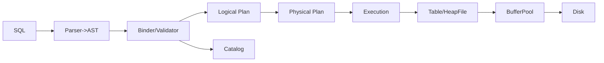

# EvolvDB

A Postgres-inspired SQL database built from scratch in Java with clean architecture, SOLID principles, and extensibility for future NoSQL models.

## Vision & Scope

- Educational yet practical: learn database internals by building core components without external DB libraries.
- Modular architecture that cleanly separates storage, execution, SQL parsing, catalog, transactions, and recovery.
- Extensible foundation for alternative data models (e.g., key-value, document) and storage engines.

## Project Status (Milestones)

### ✅ Completed
- M1: DiskManager — NIO-based page I/O with tests. Docs: `docs/storage/disk-manager.md`
- M2: BufferPool — Pin/unpin, LRU eviction (Strategy), dirty tracking, flush-on-evict. Docs: `docs/storage/buffer-pool.md`
- M3: Slotted Page — Variable-length layout, compaction, free space calc. Docs: `docs/storage/slotted-page.md`
- M4: HeapFile & RecordManager — File-level record insert/read/delete across pages. Docs: `docs/storage/heap-file.md`
- M5: Scan & Update — Sequential scans and in-place/relocate update semantics. Docs: `docs/storage/scan-and-update.md`
- M6: Catalog & Schema — Persistent TableMeta with versioned codec; CatalogManager; `Type/Schema/ColumnMeta` finalized. Docs: `docs/catalog/catalog.md`
- M7: Tuple & RowCodec — Tuple bound to Schema; RowCodec for fixed/var width; `Table` wrapper over HeapFile. Docs: `docs/tuple/tuple.md`

### 🚧 In Progress
- M8: SQL Parser & AST — Minimal grammar for CREATE/INSERT/SELECT; typed AST; validation. Docs: `docs/sql/parser.md` (to be added)

### 📌 Roadmap (Upcoming)
- M9: Logical Planner & Analyzer — Binder, type-checker, logical operators.
- M10: Physical Planning & Execution (Volcano) — Physical operators, iterator engine.
- M11: Simple Query Optimizer — Pushdowns and join heuristics.
- M12: Indexing (B+Tree) — Secondary indexes + IndexScan.
- M13: Transactions & Concurrency (2PL baseline) — Txn + Lock managers.
- M14: Durability & Recovery (WAL) — WAL, checkpoints, crash recovery.
- M15: Stretch — CBO, parallel execution, columnar extensions.

## Accomplishments (M1–M7) — Detailed

- __M1: DiskManager__
  - Modules: `evolvdb-storage-disk`
  - Public APIs: `...storage.disk.NioDiskManager`, `FileId`, `PageId`
  - Layer: Physical storage (page I/O)
  - Limits: No WAL integration yet; no page LSN enforcement

- __M2: BufferPool__
  - Modules: `evolvdb-storage-buffer`
  - Public APIs: `BufferPool`, `DefaultBufferPool`, `EvictionPolicy`, `LruEvictionPolicy`
  - Layer: Caching/buffer management
  - Limits: No async flush; no group commit; no per-page latches

- __M3: Slotted Page Format__
  - Modules: `evolvdb-storage-page`
  - Public APIs: `Page`, `PageFormat`, `SlottedPageFormat`
  - Layer: On-page record layout (variable-length)
  - Limits: No page header LSN; no MVCC tuple versioning

- __M4: HeapFile & RecordManager__
  - Modules: `evolvdb-storage-record`
  - Public APIs: `HeapFile`, `RecordManager`
  - Layer: Record file across pages
  - Limits: No free-space map; no index hooks

- __M5: Scan & Update__
  - Modules: `evolvdb-storage-record`, `evolvdb-storage-page`
  - Public APIs: `HeapFile.iterator/scan/update`, `PageFormat.slotCount/isLive/update`
  - Layer: Record access patterns
  - Limits: No predicate/projection pushdown

- __M6: Catalog & Schema__
  - Modules: `evolvdb-catalog`, `evolvdb-core`, `evolvdb-types`
  - Public APIs: `CatalogManager`, `TableMeta`, `TableId`, `TableMetaCodec`, `Database.catalog()`, `Type`, `ColumnMeta`, `Schema`
  - Layer: Metadata (persistent)
  - Limits: No `IndexMeta`; no namespaces; simple upsert/drop log

- __M7: Tuple & RowCodec__
  - Modules: `evolvdb-types`, `evolvdb-catalog`, `evolvdb-cli`
  - Public APIs: `Tuple`, `RowCodec`, `catalog.Table`
  - Layer: Typed tuples bound to schema; bytes bridge for storage
  - Limits: No nulls/defaults; string len u16; no expression engine yet

## Map to SQL Database Stack

- __Implemented__: Physical storage, buffer manager, page layout, heap files, catalog with schemas, tuple layer with row encoding.
- __Missing/Planned__:
  - SQL front-end (parser/AST, binder/validator) — parse and type-check SQL
  - Logical Planner — RA operators with schema propagation
  - Physical Planning & Execution (Volcano) — iterator engine, operators
  - Optimizer — rule-based pushdowns and basic join order heuristics
  - Indexing — B+Tree, IndexScan, index-aware plans
  - Transactions — 2PL or MVCC, Txn/Lock managers, isolation
  - Durability & Recovery — WAL, checkpoints, crash recovery

Pipeline overview:



## Module Overview

- `evolvdb-common`: shared exceptions/utilities
- `evolvdb-config`: `DbConfig` (page size, buffer pool size, data dir, ...)
- `evolvdb-types`: type system and schema (`Type`, `ColumnMeta`, `Schema`), plus row APIs (`Tuple`, `RowCodec`)
- `evolvdb-storage-disk`: `DiskManager`, `NioDiskManager`, tests
- `evolvdb-storage-page`: page abstractions and formats (`Page`, `PageFormat`, `SlottedPageFormat`), tests
- `evolvdb-storage-buffer`: `BufferPool`, eviction policies (`EvictionPolicy`, `LruEvictionPolicy`), tests
- `evolvdb-storage-record`: `HeapFile`, `RecordManager`, tests
- `evolvdb-catalog`: persistent catalog manager (`TableId`, `TableMeta`, `CatalogManager`, codec)
- `evolvdb-core`: `Database` facade (composition root)
- `evolvdb-cli`: minimal CLI entrypoint for demos

Planned modules:
- `evolvdb-sql`: SQL parser, AST, validator
- `evolvdb-planner`: binder/analyzer, logical plans, rule framework
- `evolvdb-exec`: physical planner, Volcano operators, expression eval
- `evolvdb-index-btree`: B+Tree index and IndexScan
- `evolvdb-txn`: transactions and locks (2PL baseline)
- `evolvdb-wal`: write-ahead logging and recovery

## Build & Run

- Build all modules:

```bash
./gradlew clean build
```

- Run CLI:

```bash
# Preferred: configure data directory
./gradlew :evolvdb-cli:run -Devolvdb.dataDir=./data

# Or via environment variable
EVOLVDB_DATA_DIR=./data ./gradlew :evolvdb-cli:run
```

## Tests

Run all tests:

```bash
./gradlew test
```

Run specific module tests, e.g. BufferPool:

```bash
./gradlew :evolvdb-storage-buffer:test
```

## Data Directory Handling

Priority order used by CLI:
1) System property `-Devolvdb.dataDir=<path>`
2) Env var `EVOLVDB_DATA_DIR=<path>`
3) Fallback: `./data` within the repository root (auto-detected by walking up to find `settings.gradle.kts` or `gradlew`).

## Documentation

See the `docs/` folder. Start here:
- Storage subsystem overview: `docs/storage/README.md`
- DiskManager: `docs/storage/disk-manager.md`
- BufferPool: `docs/storage/buffer-pool.md`
- Slotted Page: `docs/storage/slotted-page.md`
- HeapFile: `docs/storage/heap-file.md`
- Scan & Update: `docs/storage/scan-and-update.md`
- Catalog & Schema: `docs/catalog/catalog.md`
- Tuple & RowCodec: `docs/tuple/tuple.md`

## Detailed Roadmap (M8–M15)

### M8 — SQL Parser & AST
- HLD: Minimal grammar (CREATE TABLE, DROP TABLE, INSERT, SELECT with WHERE). Typed AST, good error messages.
- LLD / Modules: `evolvdb-sql`
  - `...sql.parser.SqlParser`, `...sql.ast.*` (`Statement`, `CreateTable`, `Insert`, `Select`, `Expr`), `...sql.validate.AstValidator`
  - Patterns: Visitor (AST), Builder/Factory for expressions
- APIs: `SqlParser.parse(String) -> Statement`, `AstValidator.validate(Statement)`
- Tests (BDD): `givenCreateTable_whenParse_thenAstMatches()`, `givenInvalidSql_whenParse_thenErrorWithPosition()`
- Docs: `docs/sql/parser.md` (to be added)
- README snippet: `- M8: SQL Parser & AST — Minimal grammar for CREATE/INSERT/SELECT; typed AST; docs: docs/sql/parser.md`

### M9 — Logical Planner & Analyzer
- HLD: AST→logical plan; binder resolves names via Catalog; schema/type propagation; simple rewrites.
- LLD / Modules: `evolvdb-planner` (deps: sql, catalog, types)
  - `...planner.bind.Binder`, logical nodes `LogicalScan/Project/Filter/Join/Aggregate/Insert`
  - Rules: `Rule`, `RuleEngine`; Type inference
  - Patterns: Visitor (plans), Strategy (rules)
- APIs: `Planner.plan(Statement, CatalogManager) -> LogicalPlan`, `RuleEngine.apply(LogicalPlan)`
- Tests: `givenSelectWhere_whenPlan_thenFilterOverScan()`, `givenUnknownColumn_whenBind_thenError()`
- Docs: `docs/planner/logical-plans.md` (to be added)
- README snippet: `- M9: Logical Planner — AST→logical plan with binder, type-check; docs: docs/planner/logical-plans.md`

### M10 — Physical Planning & Execution (Volcano)
- HLD: Volcano iterators; operators: SeqScan, Filter, Project, NestedLoopJoin, Aggregate (hash later).
- LLD / Modules: `evolvdb-exec` (deps: planner, catalog, types, storage-record)
  - `...exec.Operator` (open/next/close), `SeqScanOp`, `FilterOp`, `ProjectOp`, `NestedLoopJoinOp`
  - `...exec.expr.ExprEvaluator`, `...exec.PhysicalPlanner`
  - Patterns: Template (operator lifecycle), Factory (ops), Strategy (expr eval)
- APIs: `PhysicalPlanner.plan(LogicalPlan) -> Operator`
- Tests: `givenSeqScan_whenOpenNextClose_thenYieldsAllTuples()`, IT: `givenSelectWhere_whenExecute_thenRowsMatch()`
- Docs: `docs/execution/volcano.md` (to be added)
- Mermaid:

- README snippet: `- M10: Execution (Volcano) — Physical operators and iterator engine; docs: docs/execution/volcano.md`

### M11 — Simple Query Optimizer
- HLD: Rule-based pushdowns (predicate/projection), simple join heuristics.
- LLD / Modules: extend `evolvdb-planner`
  - Rules: `PushdownPredicatesRule`, `PushdownProjectionsRule`, `JoinHeuristicRule`
  - `...planner.cost.CostModel` skeleton
- APIs: `Optimizer.optimize(LogicalPlan, CatalogStats) -> LogicalPlan`
- Tests: `givenFilterOverJoin_whenOptimize_thenPredicatePushed()`, `givenWideSelect_whenOptimize_thenProjectionPushed()`
- Docs: `docs/planner/optimizer.md` (to be added)
- README snippet: `- M11: Optimizer — Pushdowns and join heuristics; docs: docs/planner/optimizer.md`

### M12 — Indexing (B+Tree)
- HLD: B+Tree on-disk with cursor scans; Catalog `IndexMeta`; `IndexScan` op.
- LLD / Modules: `evolvdb-index-btree`; changes in `catalog`, `exec`, `planner`
  - `...index.btree.BPlusTree`, `...index.btree.PageLayout`, `IndexManager`
  - Exec: `IndexScanOp`; Planner rule for index selection
  - Patterns: Strategy (key comparator), Factory (index create/open), Iterator (cursor)
- APIs: `IndexManager.createIndex(...) -> IndexId`, `BPlusTree.search/range(...)`
- Tests: `givenBTree_whenSplitMerge_thenInvariantHolds()`, IT: `givenIndexedFilter_whenExecute_thenUsesIndexScan()`
- Docs: `docs/index/btree.md` (to be added)
- Mermaid (planning):

- README snippet: `- M12: Indexing (B+Tree) — Secondary indexes + IndexScan; docs: docs/index/btree.md`

### M13 — Transactions & Concurrency (2PL baseline)
- HLD: Strict 2PL; `TxnManager`, `LockManager`; `TransactionContext` threaded through ops.
- LLD / Modules: `evolvdb-txn`; changes in `exec`, `storage-record`, `buffer`
  - `...txn.TransactionManager`, `Transaction`, `LockManager`; lock table by `RecordId`/`PageId`
  - Patterns: Strategy (deadlock handling), RAII (try-with-resources for txns)
- APIs: `TransactionManager.begin()`, `commit()`, `abort()`; `Table.*(TransactionContext, ...)`
- Tests: concurrency/isolation BDD; no dirty reads; writer-writer contention
- Docs: `docs/transactions/concurrency.md` (to be added)
- README snippet: `- M13: Transactions (2PL) — Txn + Lock managers; docs: docs/transactions/concurrency.md`

### M14 — Durability & Recovery (WAL)
- HLD: WAL with LSN; checkpoints; recovery (analyze/redo/undo)
- LLD / Modules: `evolvdb-wal`; changes in `storage-page` (pageLSN), `buffer` (flush policy)
  - `...wal.LogManager`, `...wal.records.*`, `...wal.RecoveryManager`
  - Patterns: Template (recovery phases), Factory (log records)
- APIs: `LogManager.append(LogRecord)->LSN`, `RecoveryManager.recover()`; flush respects `pageLSN <= durableLSN`
- Tests: crash simulation and recovery correctness (redo/undo)
- Docs: `docs/recovery/wal.md` (to be added)
- Mermaid (WAL order):
```mermaid
sequenceDiagram
  participant Tx as Transaction
  participant WAL as LogManager
  participant BP as BufferPool
  participant DM as DiskManager
  Tx->>WAL: append(UPDATE)
  WAL-->>Tx: LSN
  Tx->>BP: apply change (pageLSN=LSN)
  Tx->>WAL: append(COMMIT); flush
  BP->>DM: flush page (only if pageLSN <= durableLSN)
```
- README snippet: `- M14: Durability (WAL) — WAL, checkpoints, crash recovery; docs: docs/recovery/wal.md`

### M15 — Stretch
- HLD: CBO, parallel exec, columnar extension, replication, metrics
- Modules: `evolvdb-optimizer-cbo`, `evolvdb-columnar`, `evolvdb-metrics` (future)
- README snippet: `- M15: Stretch — CBO, parallel exec, columnar extensions`

## Scalability & Extensibility Plan

- Storage: free-space map; background compaction; extent allocation; pluggable `PageFormat` variants
- BufferPool: alternative eviction; async flushers; prefetch; throttling
- Catalog: versioned codec already; add namespaces, `IndexMeta`, table options
- Indexes: multiple secondary indexes per table, independent files
- Concurrency: latches vs locks; MVCC path as future variant

## Testing & Coverage Strategy

- Unit: disk I/O boundaries; buffer eviction & dirty handling; slot invariants; heapfile relocate vs in-place; catalog replay; row codec
- Integration: end-to-end Catalog→Table→Tuple; multi-page datasets; eviction under pressure; restart persistence
- Property-based: random op sequences; B+Tree invariants
- Fault-injection: IO exceptions; disk full; crash points for WAL
- Concurrency: multithreaded harness; deterministic barriers where possible
- Recovery: replay logs and validate state
- Coverage policy: enable JaCoCo; ≥95% for foundation (disk/buffer/page/heapfile/catalog/types); optional mutation testing (PIT) for B+Tree/WAL/eviction

## Regression & CI Practices

- Pipeline: build → unit tests → integration tests → coverage gates → static analysis (SpotBugs/Checkstyle) → docs link check
- Branching: feature branches, PR reviews, code owners for core modules
- Releases: tag per milestone, update README/docs accordingly

## README & Docs Policy

- Every milestone must:
  - Update “Completed/In Progress” with 1–2 lines and doc links
  - Add/adjust module list with one-liners
  - Add docs under `docs/*` with HLD/LLD + Mermaid; cross-link from related docs
  - Keep this roadmap section updated with HLD/LLD summaries and README snippets

Diagrams are provided using Mermaid (flows, sequences, class relationships). All components include HLD, LLD, patterns, SOLID notes, and trade-offs.

## Contribution Guidelines

- Follow SOLID principles and clean OOP design.
- Keep modules decoupled and avoid leaking implementation details across boundaries.
- Use Strategy/Factory/Builder/etc. where appropriate; call out patterns in code comments and docs.
- Tests must use behavior-driven naming (given...when...then...).
- Every milestone change must include: code + tests + docs.

## Java Toolchain

- Target: Java 21 LTS via Gradle toolchain
- Development: you can use Java 23 locally; Gradle compiles against 21 for compatibility.
