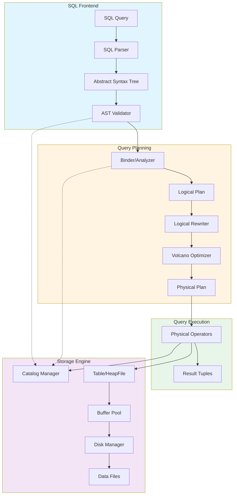
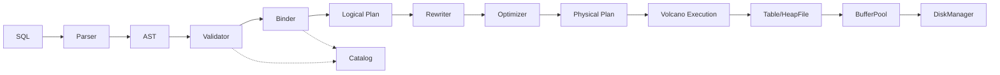
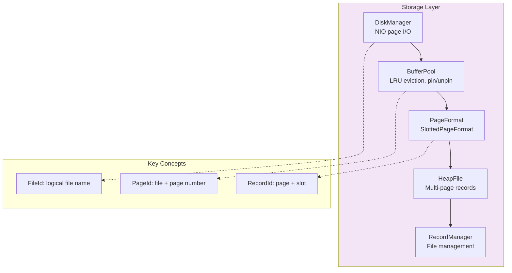
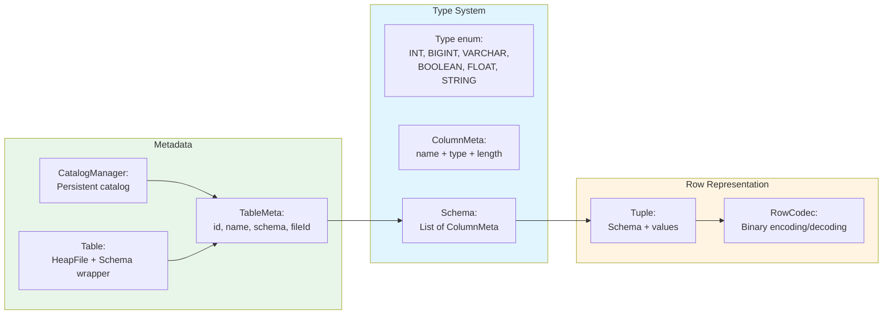
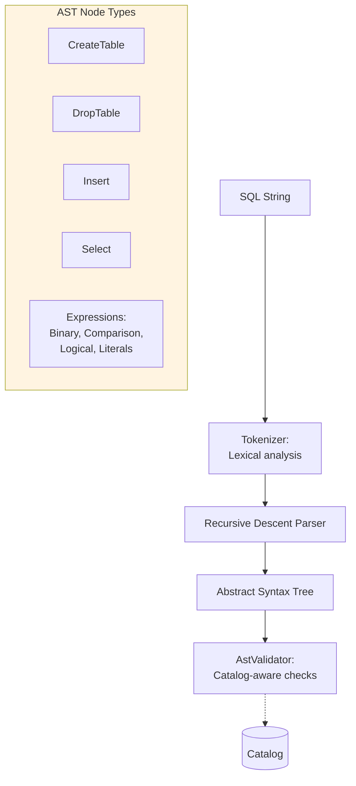
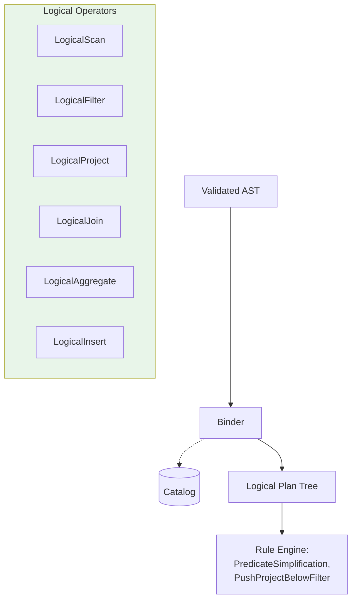
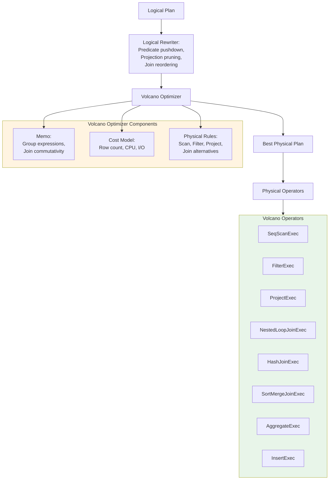
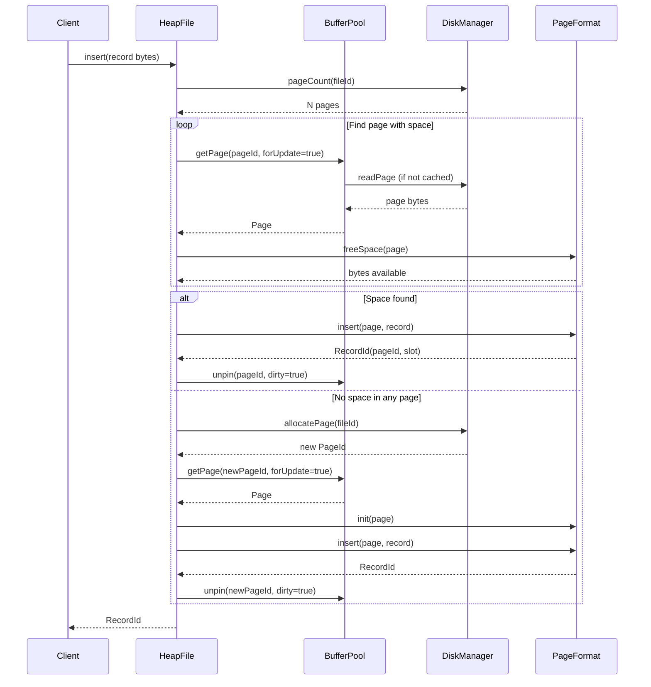
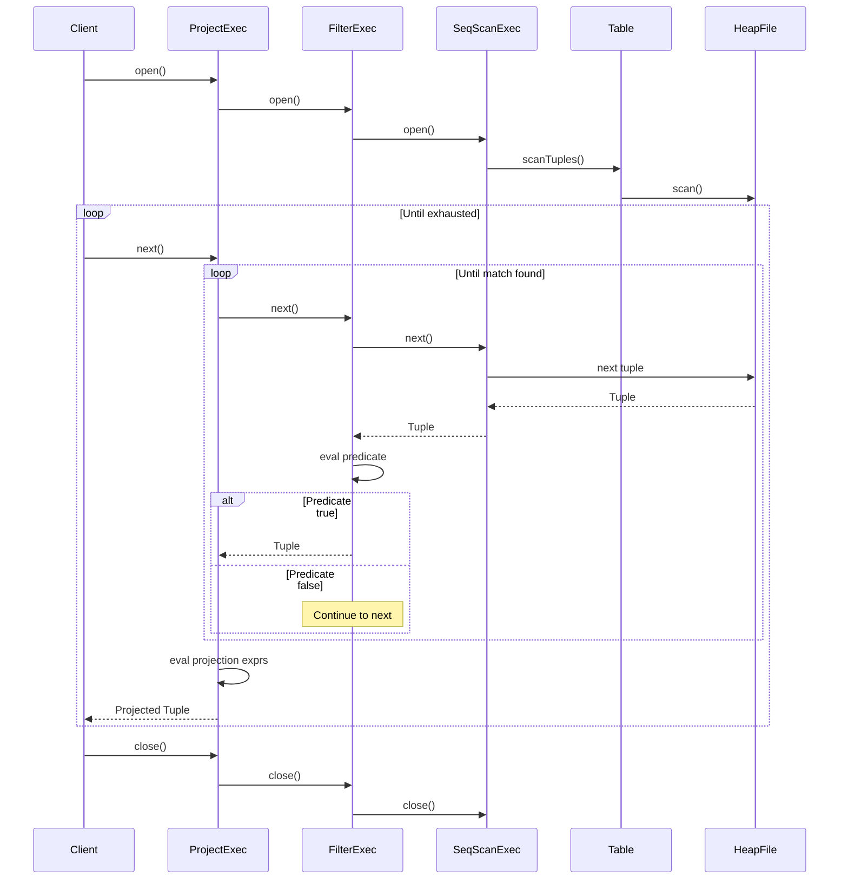
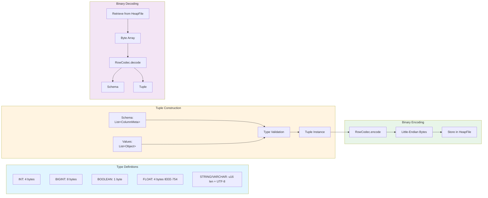

# EvolvDB

A Postgres-inspired SQL database built from scratch in Java with clean architecture, SOLID principles, and extensibility for future NoSQL models.

## Vision & Scope

- Educational yet practical: learn database internals by building core components without external DB libraries.
- Modular architecture that cleanly separates storage, execution, SQL parsing, catalog, transactions, and recovery.
- Extensible foundation for alternative data models (e.g., key-value, document) and storage engines.

## Project Status (Milestones)

### ✅ Completed
- M1: DiskManager — NIO-based page I/O with tests. Docs: `docs/storage/disk-manager.md`
- M2: BufferPool — Pin/unpin, LRU eviction (Strategy), dirty tracking, flush-on-evict. Docs: `docs/storage/buffer-pool.md`
- M3: Slotted Page — Variable-length layout, compaction, free space calc. Docs: `docs/storage/slotted-page.md`
- M4: HeapFile & RecordManager — File-level record insert/read/delete across pages. Docs: `docs/storage/heap-file.md`
- M5: Scan & Update — Sequential scans and in-place/relocate update semantics. Docs: `docs/storage/scan-and-update.md`
- M6: Catalog & Schema — Persistent TableMeta with versioned codec; CatalogManager; `Type/Schema/ColumnMeta` finalized. Docs: `docs/catalog/catalog.md`
- M7: Tuple & RowCodec — Tuple bound to Schema; RowCodec for fixed/var width; `Table` wrapper over HeapFile. Docs: `docs/tuple/tuple.md`
- M8: SQL Parser & AST — Minimal grammar for CREATE/INSERT/SELECT; typed AST; validator integrated with Catalog. Docs: `docs/sql/parser.md`
- M9: Logical Planner & Analyzer — AST→logical plan with binder, type-check; docs: `docs/planner/logical-plans.md`
- M10: Physical Planner & Execution (Volcano) — Physical operators, iterator engine. Docs: `docs/execution/physical-plans.md`
- M11: Query Optimizer — Volcano-style optimizer with memo, cost model, join algorithms (NLJ/HashJoin/SortMergeJoin), predicate pushdown, projection pruning, join reordering. Docs: `docs/optimizer/volcano.md`

### 🚧 In Progress  
- M12: UPDATE & DELETE Statements - SQL parsing, logical/physical planning, execution complete. Testing in progress.

### 📌 Production Roadmap (M12-M25)

**See `docs/milestones/ROADMAP_M12-M25.md` for detailed specifications.**

#### Phase 1: Basic SQL & Type System (2-3 weeks)
- M12: UPDATE & DELETE Statements ⭐ **START HERE** (3-4 days)
- M13: NULL Support & Three-Valued Logic (4-5 days)
- M14: DEFAULT Values & Basic Constraints (3-4 days)
- M15: ORDER BY, LIMIT, OFFSET (3-4 days)

#### Phase 2: Production Essentials (7-10 weeks) 🔥 CRITICAL
- M16: B+Tree Indexing (2-3 weeks) - 10-1000x query speedup
- M17: Transactions & Concurrency (2PL) (3-4 weeks) - ACID guarantees
- M18: Write-Ahead Log & Recovery (ARIES) (3-4 weeks) - Crash recovery

#### Phase 3: Standard SQL Compliance (8-10 weeks)
- M19: Statistics & Improved Cost Model (2 weeks)
- M20: ANSI JOIN Syntax & OUTER JOINs (2 weeks)
- M21: Subqueries & CTEs (2-3 weeks)
- M22: Advanced Aggregations & Window Functions (2-3 weeks)

#### Phase 4: Performance & Operations (7-8 weeks)
- M23: Parallel Query Execution (3 weeks)
- M24: Advanced Indexing Strategies (2 weeks)
- M25: Monitoring, Metrics & Operations (2 weeks)

**Estimated Timeline:**
- To Production-Ready (M12-M18): ~3 months
- To Feature-Complete (M12-M25): ~6 months

## Accomplishments (M1–M7) — Detailed

- __M1: DiskManager__
  - Modules: `evolvdb-storage-disk`
  - Public APIs: `...storage.disk.NioDiskManager`, `FileId`, `PageId`
  - Layer: Physical storage (page I/O)
  - Limits: No WAL integration yet; no page LSN enforcement

- __M2: BufferPool__
  - Modules: `evolvdb-storage-buffer`
  - Public APIs: `BufferPool`, `DefaultBufferPool`, `EvictionPolicy`, `LruEvictionPolicy`
  - Layer: Caching/buffer management
  - Limits: No async flush; no group commit; no per-page latches

- __M3: Slotted Page Format__
  - Modules: `evolvdb-storage-page`
  - Public APIs: `Page`, `PageFormat`, `SlottedPageFormat`
  - Layer: On-page record layout (variable-length)
  - Limits: No page header LSN; no MVCC tuple versioning

- __M4: HeapFile & RecordManager__
  - Modules: `evolvdb-storage-record`
  - Public APIs: `HeapFile`, `RecordManager`
  - Layer: Record file across pages
  - Limits: No free-space map; no index hooks

- __M5: Scan & Update__
  - Modules: `evolvdb-storage-record`, `evolvdb-storage-page`
  - Public APIs: `HeapFile.iterator/scan/update`, `PageFormat.slotCount/isLive/update`
  - Layer: Record access patterns
  - Limits: No predicate/projection pushdown

- __M6: Catalog & Schema__
  - Modules: `evolvdb-catalog`, `evolvdb-core`, `evolvdb-types`
  - Public APIs: `CatalogManager`, `TableMeta`, `TableId`, `TableMetaCodec`, `Database.catalog()`, `Type`, `ColumnMeta`, `Schema`
  - Layer: Metadata (persistent)
  - Limits: No `IndexMeta`; no namespaces; simple upsert/drop log

- __M7: Tuple & RowCodec__
  - Modules: `evolvdb-types`, `evolvdb-catalog`, `evolvdb-cli`
  - Public APIs: `Tuple`, `RowCodec`, `catalog.Table`
  - Layer: Typed tuples bound to schema; bytes bridge for storage
  - Limits: No nulls/defaults; string len u16; no expression engine yet

## Map to SQL Database Stack

- __Implemented__: Physical storage, buffer manager, page layout, heap files, catalog with schemas, tuple layer with row encoding.
- __Missing/Planned__:
  - SQL front-end (parser/AST, binder/validator) — parse and type-check SQL
  - Logical Planner — RA operators with schema propagation
  - Physical Planning & Execution (Volcano) — iterator engine, operators
  - Optimizer — rule-based pushdowns and basic join order heuristics; advanced rewrites (constant folding, projection pruning)
  - Indexing — B+Tree, IndexScan, index-aware plans
  - Transactions — 2PL or MVCC, Txn/Lock managers, isolation
  - Durability & Recovery — WAL, checkpoints, crash recovery

## Architecture Overview

### High-Level Architecture (End-to-End)


```mermaid
flowchart TB
    subgraph Frontend["SQL Frontend"]
        SQL[SQL Query] --> Parser[SQL Parser]
        Parser --> AST[Abstract Syntax Tree]
        AST --> Validator[AST Validator]
    end
    
    subgraph Planning["Query Planning"]
        Validator --> Binder[Binder/Analyzer]
        Binder --> LogPlan[Logical Plan]
        LogPlan --> Rewriter[Logical Rewriter]
        Rewriter --> Optimizer[Volcano Optimizer]
        Optimizer --> PhysPlan[Physical Plan]
    end
    
    subgraph Execution["Query Execution"]
        PhysPlan --> Operators[Physical Operators]
        Operators --> Results[Result Tuples]
    end
    
    subgraph Storage["Storage Engine"]
        Operators --> Catalog[Catalog Manager]
        Operators --> Table[Table/HeapFile]
        Table --> Buffer[Buffer Pool]
        Buffer --> Disk[Disk Manager]
        Disk --> Files[Data Files]
    end
    
    Binder -.-> Catalog
    Validator -.-> Catalog
    
    style Frontend fill:#e1f5ff
    style Planning fill:#fff4e1
    style Execution fill:#e8f5e9
    style Storage fill:#f3e5f5
```

### Component Pipeline


```mermaid
flowchart LR
  SQL --> P[Parser] --> AST[AST] --> V[Validator] --> B[Binder] --> L[Logical Plan]
  L --> RW[Rewriter] --> O[Optimizer] --> PP[Physical Plan] --> X[Volcano Execution]
  X --> T[Table/HeapFile] --> BP[BufferPool] --> DM[DiskManager]
  B -.-> C[Catalog]
  V -.-> C
```

## Detailed Layer Architecture

### Layer 1: Storage Foundation (M1-M5)


```mermaid
flowchart TB
    subgraph Layer1["Storage Layer"]
        DM[DiskManager<br/>NIO page I/O] --> BP[BufferPool<br/>LRU eviction, pin/unpin]
        BP --> PF[PageFormat<br/>SlottedPageFormat]
        PF --> HF[HeapFile<br/>Multi-page records]
        HF --> RM[RecordManager<br/>File management]
    end
    
    subgraph Concepts["Key Concepts"]
        FileId[FileId: logical file name]
        PageId[PageId: file + page number]
        RecordId[RecordId: page + slot]
    end
    
    DM -.-> FileId
    BP -.-> PageId
    PF -.-> RecordId
    
    style Layer1 fill:#f3e5f5
```

**Smallest Building Blocks:**
- **FileId** (record): Logical name for a file (e.g., "users")
- **PageId** (record): FileId + page number (0-based)
- **RecordId** (record): PageId + slot index within page
- **DiskManager**: Allocates pages, reads/writes raw bytes
- **Page**: ByteBuffer wrapper with metadata
- **SlottedPageFormat**: Variable-length record layout with slot directory

### Layer 2: Type System & Catalog (M6-M7)


```mermaid
flowchart LR
    subgraph Types["Type System"]
        Type[Type enum:<br/>INT, BIGINT, VARCHAR,<br/>BOOLEAN, FLOAT, STRING]
        ColumnMeta[ColumnMeta:<br/>name + type + length]
        Schema[Schema:<br/>List of ColumnMeta]
    end
    
    subgraph Tuple["Row Representation"]
        T[Tuple:<br/>Schema + values]
        RC[RowCodec:<br/>Binary encoding/decoding]
    end
    
    subgraph Catalog["Metadata"]
        TM[TableMeta:<br/>id, name, schema, fileId]
        CM[CatalogManager:<br/>Persistent catalog]
        Table[Table:<br/>HeapFile + Schema wrapper]
    end
    
    Schema --> T
    T --> RC
    TM --> Schema
    CM --> TM
    Table --> TM
    
    style Types fill:#e1f5ff
    style Tuple fill:#fff4e1
    style Catalog fill:#e8f5e9
```

### Layer 3: SQL Parsing (M8)


```mermaid
flowchart TB
    SQL[SQL String] --> Tokenizer[Tokenizer:<br/>Lexical analysis]
    Tokenizer --> Parser[Recursive Descent Parser]
    Parser --> AST[Abstract Syntax Tree]
    
    subgraph ASTNodes["AST Node Types"]
        CreateTable[CreateTable]
        DropTable[DropTable]
        Insert[Insert]
        Select[Select]
        Expr[Expressions:<br/>Binary, Comparison,<br/>Logical, Literals]        
    end
    
    AST --> Validator[AstValidator:<br/>Catalog-aware checks]
    Validator -.-> Catalog[(Catalog)]
    
    style ASTNodes fill:#fff4e1
```

### Layer 4: Logical Planning (M9)


```mermaid
flowchart TB
    AST[Validated AST] --> Binder[Binder]    
    Binder -.-> Cat[(Catalog)]
    
    Binder --> LP[Logical Plan Tree]
    
    subgraph LogicalNodes["Logical Operators"]
        LS[LogicalScan]        
        LF[LogicalFilter]        
        LP2[LogicalProject]        
        LJ[LogicalJoin]        
        LA[LogicalAggregate]        
        LI[LogicalInsert]
    end
    
    LP --> Rules[Rule Engine:<br/>PredicateSimplification,<br/>PushProjectBelowFilter]
    
    style LogicalNodes fill:#e8f5e9
```

### Layer 5: Physical Planning & Execution (M10-M11)


```mermaid
flowchart TB
    LP[Logical Plan] --> LR[Logical Rewriter:<br/>Predicate pushdown,<br/>Projection pruning,<br/>Join reordering]
    
    LR --> VO[Volcano Optimizer]
    
    subgraph Optimizer["Volcano Optimizer Components"]
        Memo[Memo:<br/>Group expressions,<br/>Join commutativity]
        Cost[Cost Model:<br/>Row count, CPU, I/O]
        Rules[Physical Rules:<br/>Scan, Filter, Project,<br/>Join alternatives]
    end
    
    VO --> Memo
    VO --> Cost
    VO --> Rules
    
    VO --> PP[Best Physical Plan]
    
    PP --> Ops[Physical Operators]
    
    subgraph PhysicalOps["Volcano Operators"]
        SeqScan[SeqScanExec]        
        Filter[FilterExec]        
        Project[ProjectExec]        
        NLJ[NestedLoopJoinExec]        
        HJ[HashJoinExec]        
        SMJ[SortMergeJoinExec]        
        Agg[AggregateExec]        
        Ins[InsertExec]
    end
    
    Ops --> PhysicalOps
    
    style Optimizer fill:#fff4e1
    style PhysicalOps fill:#e8f5e9
```

## Module Overview

### Implemented Modules

- `evolvdb-common`: shared exceptions/utilities
- `evolvdb-config`: `DbConfig` (page size, buffer pool size, data dir, ...)
- `evolvdb-types`: type system and schema (`Type`, `ColumnMeta`, `Schema`), plus row APIs (`Tuple`, `RowCodec`)
- `evolvdb-storage-disk`: `DiskManager`, `NioDiskManager`, tests
- `evolvdb-storage-page`: page abstractions and formats (`Page`, `PageFormat`, `SlottedPageFormat`), tests
- `evolvdb-storage-buffer`: `BufferPool`, eviction policies (`EvictionPolicy`, `LruEvictionPolicy`), tests
- `evolvdb-storage-record`: `HeapFile`, `RecordManager`, tests
- `evolvdb-catalog`: persistent catalog manager (`TableId`, `TableMeta`, `CatalogManager`, codec)
- `evolvdb-sql`: SQL layer: Parser, AST, Validator
- `evolvdb-planner`: Logical planner (Binder/Analyzer), logical plan nodes, rule framework
- `evolvdb-exec`: physical planner, Volcano operators, expression eval, optimizer (Volcano, memo, cost model, rewrites)
- `evolvdb-core`: `Database` facade (composition root)
- `evolvdb-cli`: minimal CLI entrypoint for demos

### Planned Modules
- `evolvdb-index-btree`: B+Tree index and IndexScan
- `evolvdb-txn`: transactions and locks (2PL baseline)
- `evolvdb-wal`: write-ahead logging and recovery

## Build & Run

- Build all modules:

```bash
./gradlew clean build
```

- Run CLI:

```bash
# Preferred: configure data directory
./gradlew :evolvdb-cli:run -Devolvdb.dataDir=./data

# Or via environment variable
EVOLVDB_DATA_DIR=./data ./gradlew :evolvdb-cli:run
```

## Tests

Run all tests:

```bash
./gradlew test
```

Run specific module tests, e.g. BufferPool:

```bash
./gradlew :evolvdb-storage-buffer:test
```

## Data Directory Handling

Priority order used by CLI:
1) System property `-Devolvdb.dataDir=<path>`
2) Env var `EVOLVDB_DATA_DIR=<path>`
3) Fallback: `./data` within the repository root (auto-detected by walking up to find `settings.gradle.kts` or `gradlew`).

## Documentation

See the `docs/` folder. Start here:
- Storage subsystem overview: `docs/storage/README.md`
- DiskManager: `docs/storage/disk-manager.md`
- BufferPool: `docs/storage/buffer-pool.md`
- Slotted Page: `docs/storage/slotted-page.md`
- HeapFile: `docs/storage/heap-file.md`
- Scan & Update: `docs/storage/scan-and-update.md`
- Catalog & Schema: `docs/catalog/catalog.md`
- Tuple & RowCodec: `docs/tuple/tuple.md`

## Low-Level Design Details

### Storage Layer Data Flow


```mermaid
sequenceDiagram
    participant Client
    participant HeapFile
    participant BufferPool
    participant DiskManager
    participant PageFormat
    
    Client->>HeapFile: insert(record bytes)
    HeapFile->>DiskManager: pageCount(fileId)
    DiskManager-->>HeapFile: N pages
    
    loop Find page with space
        HeapFile->>BufferPool: getPage(pageId, forUpdate=true)
        BufferPool->>DiskManager: readPage (if not cached)
        DiskManager-->>BufferPool: page bytes
        BufferPool-->>HeapFile: Page
        HeapFile->>PageFormat: freeSpace(page)
        PageFormat-->>HeapFile: bytes available
    end
    
    alt Space found
        HeapFile->>PageFormat: insert(page, record)
        PageFormat-->>HeapFile: RecordId(pageId, slot)
        HeapFile->>BufferPool: unpin(pageId, dirty=true)
    else No space in any page
        HeapFile->>DiskManager: allocatePage(fileId)
        DiskManager-->>HeapFile: new PageId
        HeapFile->>BufferPool: getPage(newPageId, forUpdate=true)
        BufferPool-->>HeapFile: Page
        HeapFile->>PageFormat: init(page)
        HeapFile->>PageFormat: insert(page, record)
        PageFormat-->>HeapFile: RecordId
        HeapFile->>BufferPool: unpin(newPageId, dirty=true)
    end
    
    HeapFile-->>Client: RecordId
```

### Query Execution Flow (Volcano Model)


```mermaid
sequenceDiagram
    participant Client
    participant ProjectExec
    participant FilterExec
    participant SeqScanExec
    participant Table
    participant HeapFile
    
    Client->>ProjectExec: open()
    ProjectExec->>FilterExec: open()
    FilterExec->>SeqScanExec: open()
    SeqScanExec->>Table: scanTuples()
    Table->>HeapFile: scan()
    
    loop Until exhausted
        Client->>ProjectExec: next()
        loop Until match found
            ProjectExec->>FilterExec: next()
            FilterExec->>SeqScanExec: next()
            SeqScanExec->>HeapFile: next tuple
            HeapFile-->>SeqScanExec: Tuple
            SeqScanExec-->>FilterExec: Tuple
            FilterExec->>FilterExec: eval predicate
            alt Predicate true
                FilterExec-->>ProjectExec: Tuple
            else Predicate false
                Note over FilterExec: Continue to next
            end
        end
        ProjectExec->>ProjectExec: eval projection exprs
        ProjectExec-->>Client: Projected Tuple
    end
    
    Client->>ProjectExec: close()
    ProjectExec->>FilterExec: close()
    FilterExec->>SeqScanExec: close()
```

### Optimizer Decision Flow

```mermaid
flowchart TB
    Start[Logical Plan] --> LR[Logical Rewriter]
    
    subgraph LogicalOptimizations["Logical Optimizations"]
        LR --> PP[Predicate Pushdown]
        PP --> ProjPrune[Projection Pruning]
        ProjPrune --> JR[Join Reordering]
    end
    
    JR --> Opt[Volcano Optimizer]
    
    subgraph Memo["Memo Structure"]
        Opt --> Groups[Build Groups]
        Groups --> Equiv[Add Equivalent Expressions]
        Equiv --> Commute[Join Commutativity]
    end
    
    Commute --> BU[Bottom-Up Optimization]
    
    subgraph PerNode["Per Node"]
        BU --> Rules[Apply Physical Rules]
        Rules --> Alts[Generate Alternatives]
        Alts --> Cost[Estimate Costs]
        Cost --> Best[Pick Lowest Cost]
    end
    
    Best --> Final[Best Physical Plan]
    
    subgraph Examples["Example: Join Alternatives"]
        J1[NestedLoopJoin: O(n*m)]
        J2[HashJoin: O(n+m)]
        J3[SortMergeJoin: O(n log n + m log m)]
    end
    
    Alts -.-> Examples
    
    style LogicalOptimizations fill:#fff4e1
    style Memo fill:#e1f5ff
    style PerNode fill:#e8f5e9
```

### Type System & Row Encoding


```mermaid
flowchart LR
    subgraph TypeDef["Type Definitions"]
        INT[INT: 4 bytes]
        BIGINT[BIGINT: 8 bytes]
        BOOL[BOOLEAN: 1 byte]
        FLOAT[FLOAT: 4 bytes IEEE-754]
        STR[STRING/VARCHAR: u16 len + UTF-8]
    end
    
    subgraph Tuple["Tuple Construction"]
        Schema[Schema:<br/>List&lt;ColumnMeta&gt;]
        Values[Values:<br/>List&lt;Object&gt;]
        Schema --> Validate[Type Validation]
        Values --> Validate
        Validate --> T[Tuple Instance]
    end
    
    subgraph Encoding["Binary Encoding"]
        T --> RC[RowCodec.encode]
        RC --> Binary[Little-Endian Bytes]
        Binary --> Store[Store in HeapFile]
    end
    
    subgraph Decoding["Binary Decoding"]
        Retrieve[Retrieve from HeapFile]
        Retrieve --> Bytes[Byte Array]
        Bytes --> Decode[RowCodec.decode]
        Decode --> Schema2[Schema]
        Decode --> T2[Tuple]
    end
    
    style TypeDef fill:#e1f5ff
    style Tuple fill:#fff4e1
    style Encoding fill:#e8f5e9
    style Decoding fill:#f3e5f5
```

## What's Actually Implemented vs Pending

### ✅ Fully Implemented (M1-M11)

**Storage Foundation:**
- ✅ DiskManager with NIO-based page I/O
- ✅ BufferPool with LRU eviction and pin/unpin semantics
- ✅ SlottedPageFormat with variable-length records
- ✅ HeapFile multi-page record management
- ✅ Scan and in-place/relocate update operations

**Type System & Catalog:**
- ✅ Type system: INT, BIGINT, BOOLEAN, FLOAT, VARCHAR, STRING
- ✅ Schema with unique column names (case-insensitive)
- ✅ Tuple with type validation
- ✅ RowCodec binary encoding/decoding
- ✅ CatalogManager with persistent metadata
- ✅ Table abstraction over HeapFile

**SQL & Planning:**
- ✅ SQL Parser with CREATE TABLE, DROP TABLE, INSERT, SELECT
- ✅ AST with expressions (arithmetic, comparison, logical)
- ✅ AstValidator with catalog-aware checks
- ✅ Binder/Analyzer with name resolution
- ✅ Logical plan nodes (Scan, Filter, Project, Join, Aggregate, Insert)
- ✅ Rule engine for logical plan transformations

**Optimizer & Execution:**
- ✅ Volcano-style optimizer with memo structure
- ✅ Cost model with row count, CPU, I/O estimates
- ✅ Predicate pushdown across joins
- ✅ Projection pruning
- ✅ Join reordering (bushy plans via memo)
- ✅ Physical operators: SeqScan, Filter, Project
- ✅ **HashJoinExec** - fully implemented in-memory hash join
- ✅ **SortMergeJoinExec** - fully implemented sort-merge join
- ✅ **NestedLoopJoinExec** - baseline join algorithm
- ✅ **AggregateExec** - GROUP BY with COUNT/SUM/AVG/MIN/MAX
- ✅ **InsertExec** - insert rows into tables
- ✅ Expression evaluator for runtime evaluation

### ❌ Not Yet Implemented (M12-M15+)

**Indexing (M12):**
- ❌ B+Tree on-disk structure
- ❌ Index page layout (internal nodes, leaf nodes)
- ❌ Index cursor for range scans
- ❌ IndexMeta in catalog
- ❌ IndexScan physical operator
- ❌ Index-aware optimizer rules
- ❌ Multi-column indexes
- ❌ CREATE INDEX / DROP INDEX SQL support

**Transactions & Concurrency (M13):**
- ❌ TransactionManager with begin/commit/abort
- ❌ Transaction context threaded through operators
- ❌ LockManager with 2PL (Strict Two-Phase Locking)
- ❌ Lock table by RecordId/PageId
- ❌ Deadlock detection/prevention
- ❌ Isolation levels (READ COMMITTED, REPEATABLE READ)
- ❌ MVCC as alternative to 2PL
- ❌ Transaction ID in tuple headers

**Durability & Recovery (M14):**
- ❌ Write-Ahead Log (WAL) structure
- ❌ Log records (INSERT, UPDATE, DELETE, BEGIN, COMMIT, ABORT)
- ❌ LSN (Log Sequence Number) in pages
- ❌ LogManager with append and flush
- ❌ Checkpoint mechanism
- ❌ RecoveryManager with ARIES-style recovery
- ❌ Redo phase (replay committed changes)
- ❌ Undo phase (rollback uncommitted changes)
- ❌ Analyze phase (build active/dirty tables)

**Advanced Features (M15+):**
- ❌ Parallel query execution
- ❌ Columnar storage format
- ❌ Statistics collection and histogram
- ❌ Cardinality estimation with real stats
- ❌ Advanced cost-based optimization
- ❌ Materialized views
- ❌ Query result caching
- ❌ Stored procedures
- ❌ Triggers

**SQL Feature Gaps:**
- ❌ ANSI JOIN syntax (JOIN...ON instead of comma-separated FROM)
- ❌ OUTER JOIN (LEFT, RIGHT, FULL)
- ❌ HAVING clause for aggregates
- ❌ ORDER BY clause
- ❌ LIMIT/OFFSET
- ❌ Subqueries (correlated and uncorrelated)
- ❌ UNION/INTERSECT/EXCEPT
- ❌ DISTINCT
- ❌ Window functions
- ❌ Common Table Expressions (WITH)
- ❌ NULL value support
- ❌ DEFAULT values for columns
- ❌ CHECK constraints
- ❌ FOREIGN KEY constraints
- ❌ UPDATE and DELETE statements

**Type System Gaps:**
- ❌ NULL support in Tuple and RowCodec
- ❌ DECIMAL/NUMERIC for precise arithmetic
- ❌ DATE, TIME, TIMESTAMP types
- ❌ BLOB/BYTEA for binary data
- ❌ ARRAY types
- ❌ JSON type
- ❌ User-defined types

**Storage Engine Enhancements:**
- ❌ Free-space map for efficient insert
- ❌ Background compaction
- ❌ Page compression
- ❌ Extent-based allocation
- ❌ Alternative eviction policies (CLOCK, 2Q)
- ❌ Async I/O
- ❌ Prefetching
- ❌ Per-page latches (currently coarse-grained synchronization)

## Next Steps: Getting Started with M12

### Immediate Action: M12 - UPDATE & DELETE Statements

**Why start here?**
- ✅ Storage layer already supports update/delete operations
- ✅ Quick win to build momentum (~3-4 days)
- ✅ Makes database actually usable for CRUD operations
- ✅ Foundation for testing constraints, transactions later

**What you'll build:**
```sql
UPDATE users SET age = 30 WHERE id = 1;
DELETE FROM users WHERE age < 18;
```

**Implementation checklist:**
1. SQL Parser: Add UPDATE/DELETE grammar
2. AST Nodes: UpdateStmt, DeleteStmt
3. Logical Plans: LogicalUpdate, LogicalDelete
4. Physical Operators: UpdateExec, DeleteExec
5. Tests: BDD-style tests for all operations
6. Documentation: docs/sql/update-delete.md

**Quality Standards:**
- ✅ Follow existing code patterns (Visitor, Strategy, Template)
- ✅ SOLID principles (SRP for update vs delete logic)
- ✅ DRY (reuse expression evaluator from SELECT)
- ✅ Comprehensive tests (positive, negative, edge cases)
- ✅ Clean documentation with HLD/LLD diagrams

### After M12: The Critical Path to Production

Once M12 is complete, the critical path is:
1. **M13 (NULL)** → Foundation for OUTER JOIN and advanced features
2. **M16 (B+Tree)** → Performance (10-1000x speedup for indexed queries)
3. **M17 (Transactions)** → Correctness (ACID guarantees)
4. **M18 (WAL)** → Durability (crash recovery)

After M18, you have a **production-ready database** ✅

## Detailed Roadmap (M8–M15)

### M8 — SQL Parser & AST
- HLD: Minimal grammar (CREATE TABLE, DROP TABLE, INSERT, SELECT with WHERE). Typed AST, good error messages.
- LLD / Modules: `evolvdb-sql`
  - `...sql.parser.SqlParser`, `...sql.ast.*` (`Statement`, `CreateTable`, `Insert`, `Select`, `Expr`), `...sql.validate.AstValidator`
  - Patterns: Visitor (AST), Builder/Factory for expressions
- APIs: `SqlParser.parse(String) -> Statement`, `AstValidator.validate(Statement)`
- Tests (BDD): `givenCreateTable_whenParse_thenAstMatches()`, `givenInvalidSql_whenParse_thenErrorWithPosition()`
- Docs: `docs/sql/parser.md` (to be added)
- README snippet: `- M8: SQL Parser & AST — Minimal grammar for CREATE/INSERT/SELECT; typed AST; docs: docs/sql/parser.md`

### M9 — Logical Planner & Analyzer (Completed)
- HLD: AST→logical plan; binder resolves names via Catalog; schema/type propagation; joins; aggregates; simple rewrites.
- LLD / Modules: `evolvdb-planner` (deps: sql, catalog, types)
  - `...planner.analyzer.Binder`, logical nodes `LogicalScan/Project/Filter/Join/Aggregate/Insert`
  - Rules: `Rule`, `RuleEngine`; `PredicateSimplification`
  - Patterns: Visitor (plans), Strategy (rules)
- APIs: `Analyzer.analyze(Statement, CatalogManager, List<Rule>) -> LogicalPlan`, `RuleEngine.apply(LogicalPlan)`
- Tests: binder positive/negative (including ambiguous columns), join building, aggregates and group-by.
- Docs: `docs/planner/logical-plans.md`

### M10 — Physical Planning & Execution (Volcano)
- HLD: Volcano iterators; operators: SeqScan, Filter, Project, NestedLoopJoin, Aggregate.
- LLD / Modules: `evolvdb-exec` (deps: planner, catalog, types)
  - `...exec.op.PhysicalOperator` (open/next/close), `SeqScanExec`, `FilterExec`, `ProjectExec`, `NestedLoopJoinExec`, `AggregateExec`
  - `...exec.expr.ExprEvaluator`, `...exec.PhysicalPlanner`
  - Patterns: Template (operator lifecycle), Factory (ops), Strategy (expr eval)
- APIs: `PhysicalPlanner.plan(LogicalPlan, ExecContext) -> PhysicalOperator`
- Tests: end-to-end `select_filter_executes` in `evolvdb-exec`.
- Docs: `docs/execution/physical-plans.md`
- Mermaid:

```mermaid
graph LR
  SeqScan --> Filter --> Project --> Sink
```
- README snippet: `- M10: Execution (Volcano) — Physical operators and iterator engine; docs: docs/execution/physical-plans.md`

### M11 — Query Optimizer (Completed)
- HLD: Volcano-style optimizer with memo, cost model, physical rule-based search, join ordering.
- LLD / Modules: `evolvdb-exec/optimizer`
  - `VolcanoOptimizer`: bottom-up optimization with memo support
  - `Memo`, `Group`, `GroupExpr`: group equivalent expressions, join commutativity
  - `CostModel`, `DefaultCostModel`: row count, CPU, I/O estimates
  - `PhysicalRule`, `Rules`: generate physical alternatives (Scan, Filter, Project, Join variants, Aggregate, Insert)
  - `LogicalRewriter`: predicate pushdown, projection pruning, join reordering
- Physical Join Algorithms:
  - `NestedLoopJoinExec`: O(n*m) baseline
  - `HashJoinExec`: O(n+m) hash-based equi-join
  - `SortMergeJoinExec`: O(n log n + m log m) sort-merge equi-join
- APIs: `VolcanoOptimizer.optimize(LogicalPlan, ExecContext) -> PhysicalPlan`
- Tests: `OptimizerE2ETest`, `CostModelTest`, `JoinReorderingRuleTest`, `PredicatePushdownRuleTest`
- Docs: `docs/optimizer/volcano.md`
- Status: ✅ **COMPLETED** - All tests passing, HashJoin and SortMergeJoin fully functional

### M12 — Indexing (B+Tree)
- HLD: B+Tree on-disk with cursor scans; Catalog `IndexMeta`; `IndexScan` op.
- LLD / Modules: `evolvdb-index-btree`; changes in `catalog`, `exec`, `planner`
  - `...index.btree.BPlusTree`, `...index.btree.PageLayout`, `IndexManager`
  - Exec: `IndexScanOp`; Planner rule for index selection
  - Patterns: Strategy (key comparator), Factory (index create/open), Iterator (cursor)
- APIs: `IndexManager.createIndex(...) -> IndexId`, `BPlusTree.search/range(...)`
- Tests: `givenBTree_whenSplitMerge_thenInvariantHolds()`, IT: `givenIndexedFilter_whenExecute_thenUsesIndexScan()`
- Docs: `docs/index/btree.md` (to be added)
- Mermaid (planning):

```mermaid
flowchart LR
  FilterOnKey --> Rule[IndexRule] --> IndexScan --> Exec
```
- README snippet: `- M12: Indexing (B+Tree) — Secondary indexes + IndexScan; docs: docs/index/btree.md`

### M13 — Transactions & Concurrency (2PL baseline)
- HLD: Strict 2PL; `TxnManager`, `LockManager`; `TransactionContext` threaded through ops.
- LLD / Modules: `evolvdb-txn`; changes in `exec`, `storage-record`, `buffer`
  - `...txn.TransactionManager`, `Transaction`, `LockManager`; lock table by `RecordId`/`PageId`
  - Patterns: Strategy (deadlock handling), RAII (try-with-resources for txns)
- APIs: `TransactionManager.begin()`, `commit()`, `abort()`; `Table.*(TransactionContext, ...)`
- Tests: concurrency/isolation BDD; no dirty reads; writer-writer contention
- Docs: `docs/transactions/concurrency.md` (to be added)
- README snippet: `- M13: Transactions (2PL) — Txn + Lock managers; docs: docs/transactions/concurrency.md`

### M14 — Durability & Recovery (WAL)
- HLD: WAL with LSN; checkpoints; recovery (analyze/redo/undo)
- LLD / Modules: `evolvdb-wal`; changes in `storage-page` (pageLSN), `buffer` (flush policy)
  - `...wal.LogManager`, `...wal.records.*`, `...wal.RecoveryManager`
  - Patterns: Template (recovery phases), Factory (log records)
- APIs: `LogManager.append(LogRecord)->LSN`, `RecoveryManager.recover()`; flush respects `pageLSN <= durableLSN`
- Tests: crash simulation and recovery correctness (redo/undo)
- Docs: `docs/recovery/wal.md` (to be added)
- Mermaid (WAL order):
```mermaid
sequenceDiagram
  participant Tx as Transaction
  participant WAL as LogManager
  participant BP as BufferPool
  participant DM as DiskManager
  Tx->>WAL: append(UPDATE)
  WAL-->>Tx: LSN
  Tx->>BP: apply change (pageLSN=LSN)
  Tx->>WAL: append(COMMIT); flush
  BP->>DM: flush page (only if pageLSN <= durableLSN)
```
- README snippet: `- M14: Durability (WAL) — WAL, checkpoints, crash recovery; docs: docs/recovery/wal.md`

### M15 — Stretch
- HLD: CBO, parallel exec, columnar extension, replication, metrics
- Modules: `evolvdb-optimizer-cbo`, `evolvdb-columnar`, `evolvdb-metrics` (future)
- README snippet: `- M15: Stretch — CBO, parallel exec, columnar extensions`

## Scalability & Extensibility Plan

- Storage: free-space map; background compaction; extent allocation; pluggable `PageFormat` variants
- BufferPool: alternative eviction; async flushers; prefetch; throttling
- Catalog: versioned codec already; add namespaces, `IndexMeta`, table options
- Indexes: multiple secondary indexes per table, independent files
- Concurrency: latches vs locks; MVCC path as future variant

## Testing & Coverage Strategy

- Unit: disk I/O boundaries; buffer eviction & dirty handling; slot invariants; heapfile relocate vs in-place; catalog replay; row codec
- Integration: end-to-end Catalog→Table→Tuple; multi-page datasets; eviction under pressure; restart persistence
- Property-based: random op sequences; B+Tree invariants
- Fault-injection: IO exceptions; disk full; crash points for WAL
- Concurrency: multithreaded harness; deterministic barriers where possible
- Recovery: replay logs and validate state
- Coverage policy: enable JaCoCo; ≥95% for foundation (disk/buffer/page/heapfile/catalog/types); optional mutation testing (PIT) for B+Tree/WAL/eviction

## Regression & CI Practices

- Pipeline: build → unit tests → integration tests → coverage gates → static analysis (SpotBugs/Checkstyle) → docs link check
- Branching: feature branches, PR reviews, code owners for core modules
- Releases: tag per milestone, update README/docs accordingly

## README & Docs Policy

- Every milestone must:
  - Update “Completed/In Progress” with 1–2 lines and doc links
  - Add/adjust module list with one-liners
  - Add docs under `docs/*` with HLD/LLD + Mermaid; cross-link from related docs
  - Keep this roadmap section updated with HLD/LLD summaries and README snippets

Diagrams are provided using Mermaid (flows, sequences, class relationships). All components include HLD, LLD, patterns, SOLID notes, and trade-offs.

## Contribution Guidelines

- Follow SOLID principles and clean OOP design.
- Keep modules decoupled and avoid leaking implementation details across boundaries.
- Use Strategy/Factory/Builder/etc. where appropriate; call out patterns in code comments and docs.
- Tests must use behavior-driven naming (given...when...then...).
- Every milestone change must include: code + tests + docs.

## Java Toolchain

- Target: Java 21 LTS via Gradle toolchain
- Development: you can use Java 23 locally; Gradle compiles against 21 for compatibility.


SELECT * from table_1;