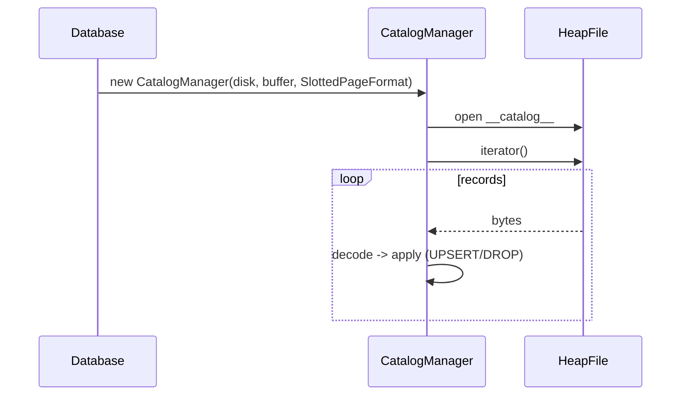

# Catalog & Schema (M6)

Status: Implemented (TableId, TableMeta, serialization, CatalogManager) with tests and CLI demo.

See also:
- [HeapFile](../storage/heap-file.md)
- [Scan and Update](../storage/scan-and-update.md)
- Types module: `evolvdb-types` (Type, ColumnMeta, Schema)

## High-Level Design (HLD)

- Catalog is a bridge between logical schema and physical storage.
- Backed by a system `HeapFile` named `__catalog__` using `SlottedPageFormat`.
- Append-only log of records with versioned encoding:
  - UPSERT(TableMeta)
  - DROP(TableId)
- On startup, scan the catalog file and reconstruct in-memory maps by name/id.

```mermaid
flowchart LR
  Client --> C[CatalogManager]
  C --> HF[HeapFile (system catalog)]
  HF --> BP[BufferPool]
  BP --> DM[DiskManager]
```

## Low-Level Design (LLD)

### Data Model

- `TableId`: positive long identifier
- `TableMeta`: id, name, schema, `FileId` for physical storage
- `Schema`: ordered columns, unique names (case-insensitive)
- `ColumnMeta`: name, type, optional length (only for VARCHAR)
- `Type`: INT, BIGINT, BOOLEAN, VARCHAR, FLOAT, STRING

### Serialization (TableMetaCodec)

- Versioned (v1) little-endian binary format
- UPSERT encoding:
  - [u16 version][u8 kind=1][u64 id]
  - [u16 nameLen][name bytes]
  - [u16 colCount]
  - repeated per column:
    - [u16 colNameLen][colName]
    - [u8 typeOrdinal]
    - [i32 varcharLen or -1]
  - [u16 fileNameLen][fileName]
- DROP encoding:
  - [u16 version][u8 kind=2][u64 id]

### APIs (CatalogManager)

- `createTable(String, Schema) -> TableId`
- `getTable(String|TableId) -> Optional<TableMeta>`
- `dropTable(TableId)`
- `listTables() -> List<TableMeta>`

### Lifecycle



## Tests

- Create and retrieve table by name and id
- Duplicate name rejected
- Drop hides from lookups
- Restart persistence: create -> close -> reopen -> verify

## Notes

- Metadata encoding is versioned for forward compatibility.
- Catalog is independent from CLI; exposed via `Database.catalog()`.
- Future work: namespaces, table options, index metadata, migrations.
