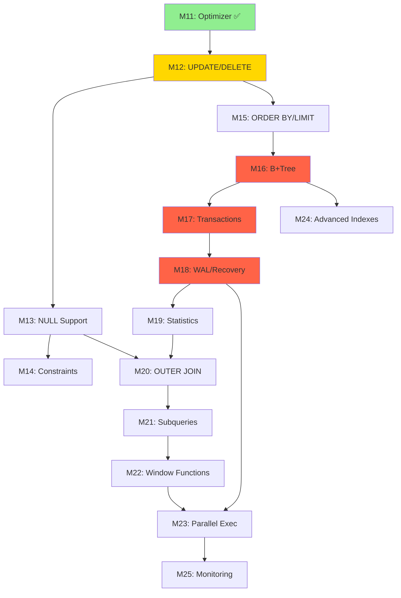

# EvolvDB Production Roadmap: M12-M25

## Guiding Principles

1. **Basics First**: Complete fundamental SQL features before advanced ones
2. **Production Quality**: Every feature must be production-ready with tests and docs
3. **Zero External Dependencies**: Pure Java implementation (except JDK)
4. **Clean Architecture**: SOLID, DRY, Design Patterns, Senior-level code quality
5. **Learning Focus**: Understand how databases work from first principles
6. **Incremental Delivery**: Each milestone is independently valuable

## Milestone Sequencing Strategy

**Phase 1 (M12-M15)**: Complete Basic SQL & Type System
- Foundation for all other features
- Makes database practically usable
- Quick wins to build momentum

**Phase 2 (M16-M18)**: Production Essentials (The "ACID" Phase)
- Indexing for performance
- Transactions for correctness
- WAL for durability
- Without these, database is not production-ready

**Phase 3 (M19-M22)**: Standard SQL Compliance
- Better optimizer with statistics
- Standard SQL features (OUTER JOIN, subqueries, CTEs)
- Advanced aggregations
- Makes database feature-complete for most applications

**Phase 4 (M23-M25)**: Performance & Operations
- Parallel execution
- Advanced indexing strategies
- Monitoring and instrumentation
- Production operations support

---

## PHASE 1: BASIC SQL & TYPE SYSTEM (M12-M15)

### M12: UPDATE & DELETE Statements ⭐ START HERE

**Priority**: HIGHEST - Makes CRUD complete
**Estimated Effort**: 3-4 days
**Dependencies**: None (storage already supports it)

#### Scope
- SQL parsing for UPDATE and DELETE
- Logical plan nodes: LogicalUpdate, LogicalDelete
- Physical operators: UpdateExec, DeleteExec
- WHERE clause support for both statements
- Multi-row updates and deletes

#### HLD
```
UPDATE users SET age = 30 WHERE id = 1;
  ↓
AST: Update(table=users, assignments=[age=30], where=id=1)
  ↓
LogicalUpdate(scan(users), filter(id=1), assignments)
  ↓
UpdateExec → HeapFile.update()

DELETE FROM users WHERE age < 18;
  ↓
AST: Delete(table=users, where=age<18)
  ↓
LogicalDelete(scan(users), filter(age<18))
  ↓
DeleteExec → HeapFile.delete()
```

#### LLD / Modules
- `evolvdb-sql/parser`: Add UPDATE/DELETE grammar
- `evolvdb-sql/ast`: UpdateStmt, DeleteStmt nodes
- `evolvdb-planner/logical`: LogicalUpdate, LogicalDelete
- `evolvdb-exec/op`: UpdateExec, DeleteExec

#### APIs
```java
// Parser
Statement SqlParser.parse("UPDATE users SET age = 30 WHERE id = 1");

// Logical Plan
LogicalUpdate(LogicalPlan child, String tableName, 
              Map<String, Expr> assignments, Expr whereClause);

// Physical Operator
UpdateExec(CatalogManager catalog, LogicalUpdate plan);
int execute(); // returns rows affected
```

#### Design Patterns
- **Visitor**: AST traversal for UPDATE/DELETE
- **Strategy**: Update semantics (in-place vs relocate)
- **Template**: Operator lifecycle

#### Tests (BDD)
- `givenTable_whenUpdateWithWhere_thenRowsModified()`
- `givenTable_whenDeleteWithWhere_thenRowsRemoved()`
- `givenUpdateLargerValue_whenRelocate_thenRecordIdChanges()`
- `givenMultiRowUpdate_whenExecute_thenAllMatchingRowsUpdated()`
- `givenDeleteAll_whenNoWhere_thenTableEmpty()`

#### Docs
- `docs/sql/update-delete.md`

#### SOLID/Clean Code Considerations
- SRP: Separate update logic from delete logic
- OCP: Extensible for future UPDATE...FROM joins
- DRY: Reuse expression evaluation from SELECT

---

### M13: NULL Support & Three-Valued Logic

**Priority**: HIGH - Foundation for many SQL features
**Estimated Effort**: 4-5 days
**Dependencies**: M12 (need UPDATE to test NULL assignments)

#### Scope
- NULL literal in SQL
- NULL bitmap in RowCodec
- Three-valued logic (TRUE, FALSE, NULL) in expressions
- IS NULL / IS NOT NULL predicates
- NULL handling in aggregates (ignore nulls in SUM/AVG/COUNT)
- COALESCE function

#### HLD
```
Tuple encoding with NULL bitmap:
[bitmap (1 byte per 8 columns)][non-null values]

Example: (id=1, name=NULL, age=30)
Bitmap: 0b010 (2nd column is NULL)
Bytes: [0x02][4 bytes for id=1][4 bytes for age=30]
        ↑ name is omitted

Three-valued logic:
- NULL AND TRUE  = NULL
- NULL OR FALSE  = NULL
- NULL = NULL    = NULL (not TRUE!)
- IS NULL / IS NOT NULL returns TRUE/FALSE
```

#### LLD / Modules
- `evolvdb-types/Type`: Add NULL support flag
- `evolvdb-types/ColumnMeta`: Add `nullable` boolean
- `evolvdb-types/Tuple`: Allow null values
- `evolvdb-types/RowCodec`: NULL bitmap encoding
- `evolvdb-sql/ast`: Add NullLiteral, IsNullExpr
- `evolvdb-exec/expr`: Three-valued logic in ExprEvaluator

#### NULL Bitmap Encoding
```java
// For N columns, use (N + 7) / 8 bytes for bitmap
// Bit i = 1 means column i is NULL

class RowCodec {
    byte[] encode(Schema schema, Tuple tuple) {
        int nullBitmapSize = (schema.size() + 7) / 8;
        byte[] bitmap = new byte[nullBitmapSize];
        List<byte[]> nonNullValues = new ArrayList<>();
        
        for (int i = 0; i < schema.size(); i++) {
            Object val = tuple.get(i);
            if (val == null) {
                setBit(bitmap, i);
            } else {
                nonNullValues.add(encodeValue(val, schema.columns().get(i)));
            }
        }
        
        return concat(bitmap, nonNullValues);
    }
}
```

#### Design Patterns
- **Null Object**: Consider using a NULL sentinel value internally
- **Strategy**: NULL handling strategies for different operators

#### Tests
- `givenNullValue_whenInsert_thenStored()`
- `givenNullInWhere_whenFilter_thenThreeValuedLogic()`
- `givenNullInAggregate_whenCount_thenIgnored()`
- `givenIsNull_whenEvaluate_thenCorrectResult()`
- `givenCoalesce_whenFirstNull_thenSecondValue()`

#### SOLID Considerations
- SRP: Separate NULL bitmap logic from value encoding
- OCP: Extensible for future sparse column encoding

---

### M14: DEFAULT Values & Basic Constraints

**Priority**: MEDIUM - Essential table features
**Estimated Effort**: 3-4 days
**Dependencies**: M13 (NULL support)

#### Scope
- DEFAULT clause in CREATE TABLE
- Applying defaults on INSERT when column omitted
- NOT NULL constraint
- UNIQUE constraint (single column, enforced on insert/update)
- CHECK constraint (simple expressions)
- Constraint violation error messages

#### HLD
```sql
CREATE TABLE users (
    id INT NOT NULL,
    name VARCHAR(50) DEFAULT 'Anonymous',
    age INT CHECK (age >= 0),
    email VARCHAR(100) UNIQUE
);

INSERT INTO users (id, age) VALUES (1, 25);
-- Applies DEFAULT for name → (1, 'Anonymous', 25, NULL)
```

#### LLD / Modules
- `evolvdb-types/ColumnMeta`: Add `defaultValue`, `notNull`, `unique`, `checkExpr`
- `evolvdb-sql/parser`: Parse DEFAULT, constraints in CREATE TABLE
- `evolvdb-catalog/TableMeta`: Store constraint metadata
- `evolvdb-catalog/ConstraintChecker`: Validate on insert/update
- `evolvdb-exec/op/InsertExec`: Apply defaults, check constraints
- `evolvdb-exec/op/UpdateExec`: Check constraints

#### Constraint Checking Strategy
```java
interface ConstraintChecker {
    void checkNotNull(Tuple tuple, Schema schema) throws ConstraintViolationException;
    void checkUnique(Tuple tuple, Table table, int columnIndex) throws ConstraintViolationException;
    void checkCheck(Tuple tuple, Schema schema, List<CheckConstraint> checks) throws ConstraintViolationException;
}

class DefaultConstraintChecker implements ConstraintChecker {
    // Sequential checks: NOT NULL → UNIQUE → CHECK
}
```

#### Design Patterns
- **Chain of Responsibility**: Constraint checking pipeline
- **Strategy**: Different constraint validators
- **Specification**: CHECK constraint as predicate

#### Tests
- `givenDefaultValue_whenInsertWithoutColumn_thenDefaultApplied()`
- `givenNotNullConstraint_whenInsertNull_thenError()`
- `givenUniqueConstraint_whenInsertDuplicate_thenError()`
- `givenCheckConstraint_whenInsertInvalid_thenError()`

#### SOLID Considerations
- SRP: Separate constraint checker from insert/update logic
- OCP: Easy to add new constraint types (PRIMARY KEY, FOREIGN KEY later)

---

### M15: ORDER BY, LIMIT, OFFSET

**Priority**: MEDIUM - Essential query features
**Estimated Effort**: 3-4 days
**Dependencies**: M12 (basic SQL complete)

#### Scope
- ORDER BY with ASC/DESC
- Multi-column sort keys
- LIMIT and OFFSET
- NULL ordering (NULLS FIRST / NULLS LAST)
- Optimizations: top-N heap for LIMIT

#### HLD
```sql
SELECT name, age FROM users 
ORDER BY age DESC, name ASC 
LIMIT 10 OFFSET 20;

Logical Plan:
  Limit(10, 20)
    ↓
  Sort(keys=[age DESC, name ASC])
    ↓
  Project(name, age)
    ↓
  Scan(users)

Physical Plan:
  LimitExec(10, 20)
    ↓
  SortExec(keys=[age DESC, name ASC])  // or TopNExec if LIMIT present
    ↓
  ProjectExec(name, age)
    ↓
  SeqScanExec(users)
```

#### LLD / Modules
- `evolvdb-sql/ast`: OrderBy, Limit nodes in Select
- `evolvdb-planner/logical`: LogicalSort, LogicalLimit
- `evolvdb-exec/op`: SortExec, TopNExec, LimitExec
- `evolvdb-exec/util`: Comparator for multi-key sort

#### Sort Implementation
```java
class SortExec implements PhysicalOperator {
    private List<Tuple> sorted;
    private int cursor;
    
    void open() {
        List<Tuple> all = collectAll(child);
        sorted = all.stream()
            .sorted(buildComparator(sortKeys))
            .collect(Collectors.toList());
        cursor = 0;
    }
    
    Tuple next() {
        return cursor < sorted.size() ? sorted.get(cursor++) : null;
    }
}

class TopNExec implements PhysicalOperator {
    private PriorityQueue<Tuple> heap; // Max heap of size N
    // More efficient than full sort when N << total rows
}
```

#### Design Patterns
- **Strategy**: Comparator for different sort keys
- **Template**: Streaming vs materialized operators
- **Optimization**: Top-N heap instead of full sort

#### Tests
- `givenUnsortedData_whenOrderBy_thenSorted()`
- `givenMultiKeySort_whenExecute_thenCorrectOrder()`
- `givenLimit_whenExecute_thenOnlyNRows()`
- `givenOffset_whenExecute_thenSkipRows()`
- `givenTopN_whenLimit_thenHeapUsed()`

---

## PHASE 2: PRODUCTION ESSENTIALS (M16-M18)

### M16: B+Tree Indexing 🔥 CRITICAL

**Priority**: CRITICAL - Performance foundation
**Estimated Effort**: 2-3 weeks
**Dependencies**: M12-M15 (complete SQL basics)

#### Scope
- B+Tree on-disk structure (order-preserving)
- Index pages: internal nodes (keys + page pointers), leaf nodes (keys + RecordIds)
- Operations: search, insert, delete, range scan
- Split and merge logic
- IndexMeta in catalog
- CREATE INDEX / DROP INDEX SQL
- IndexScan physical operator
- Index-aware optimizer rules

#### HLD
```
B+Tree Structure:
- Order = 4 (fanout = 4 for internal, 4 key-value pairs for leaf)
- Internal nodes: [key1, ptr1, key2, ptr2, key3, ptr3, key4, ptr4]
- Leaf nodes: [key1, rid1, key2, rid2, key3, rid3, next_leaf_ptr]

CREATE INDEX idx_users_age ON users(age);

Index file: idx_users_age.evolv
Root page: 0
Height: 3
Entries: 10,000

Query: SELECT * FROM users WHERE age = 25;
  ↓
IndexScanExec(idx_users_age, key=25)
  ↓
B+Tree.search(25) → List<RecordId>
  ↓
HeapFile.read(recordIds)
```

#### LLD / Modules
```
evolvdb-index-btree/
  ├── BPlusTree.java           // Main B+Tree interface
  ├── BPlusTreeImpl.java        // Implementation
  ├── IndexPage.java            // Page abstraction
  ├── InternalNode.java         // Internal node logic
  ├── LeafNode.java             // Leaf node logic
  ├── IndexCursor.java          // Range scan iterator
  ├── IndexPageFormat.java      // On-disk layout
  └── KeyComparator.java        // Pluggable comparator

evolvdb-catalog/
  └── IndexMeta.java            // Index metadata

evolvdb-exec/op/
  └── IndexScanExec.java        // Index scan operator

evolvdb-optimizer/
  └── IndexSelectionRule.java   // Choose index vs seq scan
```

#### Page Layout
```
Internal Node Page (4KB):
[header: 12 bytes]
  - pageType: int (4)
  - parentPageId: int (4)  
  - keyCount: short (2)
  - level: short (2)
[keys: variable]
  - key[0], key[1], ..., key[n-1]
[child pointers: 4 bytes each]
  - ptr[0], ptr[1], ..., ptr[n]

Leaf Node Page (4KB):
[header: 16 bytes]
  - pageType: int (4)
  - parentPageId: int (4)
  - keyCount: short (2)
  - nextLeafPageId: int (4)
  - reserved: short (2)
[entries: variable]
  - [key[0], recordId[0]], [key[1], recordId[1]], ...
```

#### Insertion Algorithm
```java
class BPlusTreeImpl {
    RecordId insert(Key key, RecordId rid) {
        LeafNode leaf = findLeaf(root, key);
        if (leaf.hasSpace()) {
            leaf.insert(key, rid);
        } else {
            // Split leaf
            LeafNode newLeaf = leaf.split();
            Key midKey = newLeaf.firstKey();
            if (key < midKey) leaf.insert(key, rid);
            else newLeaf.insert(key, rid);
            insertIntoParent(leaf, midKey, newLeaf);
        }
    }
    
    void insertIntoParent(Node left, Key key, Node right) {
        if (left == root) {
            // Create new root
            InternalNode newRoot = new InternalNode();
            newRoot.addChild(left);
            newRoot.addKey(key);
            newRoot.addChild(right);
            root = newRoot;
        } else {
            InternalNode parent = left.parent();
            if (parent.hasSpace()) {
                parent.insertAfter(left, key, right);
            } else {
                // Split internal node (recursive)
                // ... similar logic
            }
        }
    }
}
```

#### Design Patterns
- **Iterator**: IndexCursor for range scans
- **Strategy**: KeyComparator for different key types
- **Factory**: IndexManager creates/opens indexes
- **Template**: Page structure (internal vs leaf)

#### Tests
- `givenEmptyTree_whenInsertMany_thenBalanced()`
- `givenFullLeaf_whenInsert_thenSplits()`
- `givenTree_whenSearch_thenFindsKey()`
- `givenTree_whenRangeScan_thenOrderedResults()`
- `givenTree_whenDeleteUntilMerge_thenMerges()`
- Property-based: B+Tree invariants maintained after random ops

#### Index Selection in Optimizer
```java
class IndexSelectionRule implements LogicalRule {
    LogicalPlan apply(LogicalPlan plan) {
        if (plan instanceof LogicalFilter f && 
            f.child() instanceof LogicalScan s) {
            // Extract predicate: column = value or column > value
            var indexes = catalog.getIndexes(s.tableName());
            for (Index idx : indexes) {
                if (canUseIndex(f.predicate(), idx)) {
                    return new LogicalIndexScan(s.tableName(), idx, extractRange(f.predicate()));
                }
            }
        }
        return plan;
    }
}
```

#### SOLID Considerations
- SRP: Separate B+Tree logic from page I/O
- OCP: Pluggable key comparators, extensible to other tree types
- DIP: Depend on Index interface, not B+Tree implementation

---

### M17: Transactions & Concurrency Control (2PL) 🔥 CRITICAL

**Priority**: CRITICAL - Correctness foundation
**Estimated Effort**: 3-4 weeks
**Dependencies**: M16 (indexing)

#### Scope
- TransactionManager (begin, commit, abort)
- Strict Two-Phase Locking (2PL)
- LockManager with lock table
- Lock types: Shared (S), Exclusive (X)
- Lock granularity: Row-level (RecordId)
- Deadlock detection (wait-for graph)
- Transaction context threaded through all operators
- Isolation levels: READ COMMITTED, REPEATABLE READ
- Transaction IDs in tuples (for future MVCC)

#### HLD
```
Transaction Lifecycle:
  begin() → txnId
    ↓
  acquire locks (implicitly during operations)
    ↓
  execute operations (read, write, update, delete)
    ↓
  commit() → release all locks
  OR
  abort() → undo changes, release all locks

Strict 2PL:
- Acquire locks as needed (growing phase)
- Hold ALL locks until commit/abort (no shrinking)
- Shared locks for reads, exclusive locks for writes

Lock Compatibility Matrix:
      | S  | X
  ----+----+----
   S  | ✓  | ✗
  ----+----+----
   X  | ✗  | ✗
```

#### LLD / Modules
```
evolvdb-txn/
  ├── Transaction.java          // Transaction handle
  ├── TransactionManager.java   // Lifecycle management
  ├── LockManager.java          // Lock acquisition/release
  ├── LockTable.java            // RecordId → lock state
  ├── DeadlockDetector.java     // Wait-for graph
  ├── IsolationLevel.java       // Enum
  └── TransactionContext.java   // Passed through operators

evolvdb-storage-record/
  └── HeapFile.java             // Add txn context to all methods

evolvdb-exec/
  └── ExecContext.java          // Add Transaction field
```

#### Lock Manager Implementation
```java
class LockManager {
    private final ConcurrentHashMap<RecordId, LockState> lockTable = new ConcurrentHashMap<>();
    private final DeadlockDetector detector = new DeadlockDetector();
    
    void acquireShared(Transaction txn, RecordId rid) throws DeadlockException {
        LockState state = lockTable.computeIfAbsent(rid, k -> new LockState());
        synchronized (state) {
            while (state.hasExclusive() && !state.isHeldBy(txn)) {
                detector.addWaitEdge(txn, state.exclusiveHolder());
                if (detector.hasCycle(txn)) {
                    throw new DeadlockException("Deadlock detected, aborting " + txn.id());
                }
                state.wait(); // Wait for exclusive lock to be released
            }
            state.addShared(txn);
            detector.removeWaitEdge(txn);
        }
    }
    
    void acquireExclusive(Transaction txn, RecordId rid) throws DeadlockException {
        LockState state = lockTable.computeIfAbsent(rid, k -> new LockState());
        synchronized (state) {
            while (state.hasAnyLocks() && !state.isOnlyHeldBy(txn)) {
                detector.addWaitEdge(txn, state.holders());
                if (detector.hasCycle(txn)) {
                    throw new DeadlockException("Deadlock detected, aborting " + txn.id());
                }
                state.wait();
            }
            state.setExclusive(txn);
            detector.removeWaitEdge(txn);
        }
    }
    
    void releaseAll(Transaction txn) {
        for (var entry : lockTable.entrySet()) {
            LockState state = entry.getValue();
            synchronized (state) {
                state.remove(txn);
                state.notifyAll(); // Wake up waiting transactions
            }
        }
    }
}

class LockState {
    private Transaction exclusiveHolder;
    private Set<Transaction> sharedHolders = new HashSet<>();
    
    boolean hasExclusive() { return exclusiveHolder != null; }
    boolean hasAnyLocks() { return exclusiveHolder != null || !sharedHolders.isEmpty(); }
    void addShared(Transaction txn) { sharedHolders.add(txn); }
    void setExclusive(Transaction txn) { exclusiveHolder = txn; }
    void remove(Transaction txn) {
        if (exclusiveHolder == txn) exclusiveHolder = null;
        sharedHolders.remove(txn);
    }
}
```

#### Deadlock Detection
```java
class DeadlockDetector {
    private final Map<Transaction, Set<Transaction>> waitGraph = new ConcurrentHashMap<>();
    
    void addWaitEdge(Transaction waiter, Transaction holder) {
        waitGraph.computeIfAbsent(waiter, k -> new HashSet<>()).add(holder);
    }
    
    boolean hasCycle(Transaction start) {
        Set<Transaction> visited = new HashSet<>();
        Set<Transaction> recStack = new HashSet<>();
        return hasCycleDFS(start, visited, recStack);
    }
    
    private boolean hasCycleDFS(Transaction txn, Set<Transaction> visited, Set<Transaction> recStack) {
        if (recStack.contains(txn)) return true; // Cycle found
        if (visited.contains(txn)) return false;
        
        visited.add(txn);
        recStack.add(txn);
        
        Set<Transaction> neighbors = waitGraph.get(txn);
        if (neighbors != null) {
            for (Transaction neighbor : neighbors) {
                if (hasCycleDFS(neighbor, visited, recStack)) return true;
            }
        }
        
        recStack.remove(txn);
        return false;
    }
}
```

#### Transaction Context Threading
```java
// All storage and execution methods take TransactionContext

class HeapFile {
    RecordId insert(TransactionContext txn, byte[] record) {
        RecordId rid = allocateSlot();
        txn.lockManager().acquireExclusive(txn.transaction(), rid);
        writeRecord(rid, record);
        txn.transaction().addUndoLog(new InsertUndo(rid)); // For abort
        return rid;
    }
    
    byte[] read(TransactionContext txn, RecordId rid) {
        txn.lockManager().acquireShared(txn.transaction(), rid);
        return readRecord(rid);
    }
}

class SeqScanExec {
    Tuple next() {
        for (Tuple t : scan) {
            RecordId rid = t.recordId();
            context.txn().lockManager().acquireShared(context.txn().transaction(), rid);
            return t;
        }
        return null;
    }
}
```

#### Design Patterns
- **RAII**: Transaction auto-close releases locks
- **Observer**: Transaction state changes notify lock manager
- **Strategy**: Isolation level strategies
- **Template**: Lock acquisition template with deadlock detection

#### Tests
- `givenTwoTransactions_whenConflict_thenBlocks()`
- `givenDeadlock_whenDetected_thenOneAborts()`
- `givenTransaction_whenAbort_thenChangesReverted()`
- `givenReadCommitted_whenReadTwice_thenMayDiffer()` (non-repeatable read)
- `givenRepeatableRead_whenReadTwice_thenSame()`
- Concurrent stress test: 100 threads, random ops, verify consistency

#### SOLID Considerations
- SRP: Separate lock management from transaction lifecycle
- OCP: Extensible to MVCC in the future
- DIP: Operators depend on TransactionContext interface

---

### M18: Write-Ahead Log & Recovery (ARIES) 🔥 CRITICAL

**Priority**: CRITICAL - Durability foundation
**Estimated Effort**: 3-4 weeks
**Dependencies**: M17 (transactions)

#### Scope
- Write-Ahead Logging (WAL) protocol
- Log records: BEGIN, COMMIT, ABORT, UPDATE, DELETE, INSERT
- LSN (Log Sequence Number) in pages
- LogManager: append, flush, checkpoint
- RecoveryManager: ARIES-style recovery (Analyze, Redo, Undo)
- Flush-before-commit protocol
- Group commit optimization

#### HLD
```
WAL Protocol:
1. Log record written to WAL BEFORE data page modified
2. Log flushed to disk BEFORE commit acknowledged
3. Data pages flushed lazily (after commit)

Log Record Types:
- BEGIN(txnId)
- UPDATE(txnId, rid, before_image, after_image)
- INSERT(txnId, rid, after_image)
- DELETE(txnId, rid, before_image)
- COMMIT(txnId)
- ABORT(txnId)
- CHECKPOINT(active_txns)

Recovery Phases (ARIES):
1. ANALYZE: Scan log, build active transaction table, dirty page table
2. REDO: Replay all operations from checkpoint forward (even aborted txns)
3. UNDO: Roll back uncommitted transactions (scan backward)
```

#### LLD / Modules
```
evolvdb-wal/
  ├── LogManager.java           // Append, flush log records
  ├── LogRecord.java            // Base class
  ├── BeginRecord.java          // Subclasses for each type
  ├── CommitRecord.java
  ├── UpdateRecord.java
  ├── InsertRecord.java
  ├── DeleteRecord.java
  ├── CheckpointRecord.java
  ├── LogIterator.java          // Scan log forward/backward
  ├── RecoveryManager.java      // ARIES recovery
  ├── ActiveTxnTable.java       // In-memory state during recovery
  └── DirtyPageTable.java

evolvdb-storage-page/
  └── Page.java                 // Add pageLSN field

evolvdb-storage-buffer/
  └── BufferPool.java           // Flush only if pageLSN <= durableLSN
```

#### Log Record Format
```
Each log record:
[LSN: long 8 bytes]
[prevLSN: long 8 bytes] // For backward scan
[txnId: long 8 bytes]
[type: byte 1 byte]     // BEGIN=1, COMMIT=2, UPDATE=3, etc.
[size: int 4 bytes]     // Payload size
[payload: variable]     // Type-specific data

Example UPDATE record:
LSN: 1000
prevLSN: 950 (previous log record for this txn)
txnId: 42
type: UPDATE (3)
size: 120
payload:
  - RecordId: pageId=5, slot=10
  - before_image: [raw bytes]
  - after_image: [raw bytes]
```

#### Log Manager Implementation
```java
class LogManager {
    private final FileChannel logChannel;
    private final ByteBuffer writeBuffer = ByteBuffer.allocate(64 * 1024); // 64KB buffer
    private long nextLSN = 0;
    private long durableLSN = 0; // Last LSN flushed to disk
    
    synchronized long append(LogRecord record) {
        long lsn = nextLSN++;
        record.setLSN(lsn);
        byte[] serialized = record.serialize();
        writeBuffer.put(serialized);
        
        if (writeBuffer.remaining() < 1024) { // Buffer almost full
            flush();
        }
        
        return lsn;
    }
    
    synchronized void flush() {
        writeBuffer.flip();
        while (writeBuffer.hasRemaining()) {
            logChannel.write(writeBuffer);
        }
        logChannel.force(false); // fsync
        durableLSN = nextLSN - 1;
        writeBuffer.clear();
    }
    
    void checkpoint() {
        // 1. Write BEGIN_CHECKPOINT record
        // 2. Flush dirty pages
        // 3. Write END_CHECKPOINT with active txns
        // 4. Flush log
    }
}

class BufferPool {
    void evict(PageId pid) {
        Frame frame = frames.get(pid);
        if (frame.dirty) {
            long pageLSN = getPageLSN(frame.buffer);
            long durableLSN = logManager.getDurableLSN();
            if (pageLSN > durableLSN) {
                logManager.flush(); // Force flush WAL first
            }
            diskManager.writePage(pid, frame.buffer, pageLSN);
        }
    }
}
```

#### ARIES Recovery
```java
class RecoveryManager {
    void recover() {
        ActiveTxnTable activeTxns = new ActiveTxnTable();
        DirtyPageTable dirtyPages = new DirtyPageTable();
        long checkpointLSN = findLastCheckpoint();
        
        // Phase 1: ANALYZE
        LogIterator iter = logManager.iterator(checkpointLSN);
        while (iter.hasNext()) {
            LogRecord rec = iter.next();
            switch (rec.type()) {
                case BEGIN -> activeTxns.add(rec.txnId());
                case COMMIT, ABORT -> activeTxns.remove(rec.txnId());
                case UPDATE, INSERT, DELETE -> {
                    activeTxns.setLastLSN(rec.txnId(), rec.lsn());
                    dirtyPages.add(rec.pageId(), rec.lsn());
                }
            }
        }
        
        // Phase 2: REDO (replay all ops from checkpoint)
        iter = logManager.iterator(checkpointLSN);
        while (iter.hasNext()) {
            LogRecord rec = iter.next();
            if (rec instanceof UpdateRecord u) {
                Page page = bufferPool.getPage(u.pageId());
                if (page.getLSN() < u.lsn()) { // Need redo
                    applyUpdate(page, u.after_image());
                    page.setLSN(u.lsn());
                }
                bufferPool.unpin(u.pageId(), true);
            }
            // Similar for INSERT, DELETE
        }
        
        // Phase 3: UNDO (roll back uncommitted txns)
        for (long txnId : activeTxns.transactions()) {
            long lastLSN = activeTxns.getLastLSN(txnId);
            undoTransaction(txnId, lastLSN);
        }
    }
    
    void undoTransaction(long txnId, long lastLSN) {
        LogIterator iter = logManager.reverseIterator(lastLSN);
        while (iter.hasNext()) {
            LogRecord rec = iter.next();
            if (rec.txnId() != txnId) continue;
            
            if (rec instanceof UpdateRecord u) {
                Page page = bufferPool.getPage(u.pageId());
                applyUpdate(page, u.before_image()); // Apply before-image
                long undoLSN = logManager.append(new CompensationLogRecord(u));
                page.setLSN(undoLSN);
                bufferPool.unpin(u.pageId(), true);
            }
            // Similar for INSERT (delete the record), DELETE (reinsert)
        }
    }
}
```

#### Design Patterns
- **Template**: Recovery phases as template method
- **Command**: Log records as commands (execute/undo)
- **Memento**: Before/after images
- **Iterator**: Log scanning forward/backward

#### Tests
- `givenTransaction_whenCrashBeforeCommit_thenChangesReverted()`
- `givenTransaction_whenCrashAfterCommit_thenChangesPreserved()`
- `givenMultipleTransactions_whenCrash_thenCorrectRecovery()`
- `givenCheckpoint_whenRecovery_thenStartFromCheckpoint()`
- Crash injection test: Random crash points, verify consistency

#### SOLID Considerations
- SRP: Separate log writing from recovery logic
- OCP: Extensible to different log record types
- DIP: Depend on LogManager interface

---

## PHASE 3: STANDARD SQL COMPLIANCE (M19-M22)

### M19: Statistics & Improved Cost Model

**Priority**: HIGH - Better query plans
**Estimated Effort**: 2 weeks
**Dependencies**: M16 (indexes), M17 (transactions)

#### Scope
- Table statistics: row count, total size
- Column statistics: distinct values, NULL count, min/max
- Histograms for non-uniform distributions
- ANALYZE command to collect stats
- Statistics persistence in catalog
- Improved cost model using real stats
- Cardinality estimation for joins, filters, aggregates

#### HLD
```sql
ANALYZE users;
-- Scans table, collects:
-- - Row count: 1,000,000
-- - Column stats:
--   - age: distinct=80, null=0, min=0, max=120, histogram=[...]
--   - name: distinct=950,000, null=1000
--   - city: distinct=100, null=0

Cost estimation with stats:
- Filter: rows * selectivity(predicate, stats)
  - age = 25: selectivity = 1 / distinct(age) = 1/80 = 0.0125
  - age > 25: selectivity = (max - 25) / (max - min) ≈ 0.79
- Join: left.rows * right.rows * joinSelectivity
  - joinSelectivity = 1 / max(distinct(left.key), distinct(right.key))
```

#### Implementation
```java
class TableStats {
    long rowCount;
    long totalBytes;
    Map<String, ColumnStats> columnStats;
}

class ColumnStats {
    long distinctCount;
    long nullCount;
    Object minValue;
    Object maxValue;
    Histogram histogram; // Optional
}

class Histogram {
    // Equi-depth histogram: divide value range into buckets
    // Each bucket has equal number of rows
    List<Bucket> buckets;
    
    double selectivity(ComparisonExpr expr) {
        // Estimate fraction of rows matching expr
    }
}

class ImprovedCostModel extends CostModel {
    Cost costSeqScan(TableStats stats) {
        return Cost.of(stats.rowCount, stats.rowCount * CPU_PER_ROW, stats.rowCount / ROWS_PER_PAGE);
    }
    
    Cost costFilter(Cost childCost, Expr predicate, TableStats stats) {
        double selectivity = estimateSelectivity(predicate, stats);
        return Cost.of(
            childCost.rowCount() * selectivity,
            childCost.cpu() + childCost.rowCount() * CPU_PER_PREDICATE,
            childCost.io()
        );
    }
    
    double estimateSelectivity(Expr expr, TableStats stats) {
        if (expr instanceof ComparisonExpr ce && ce.op() == Op.EQ && ce.right() instanceof Literal) {
            ColumnRef col = (ColumnRef) ce.left();
            ColumnStats colStats = stats.columnStats.get(col.name());
            return 1.0 / colStats.distinctCount; // Uniform assumption
        }
        // ... more sophisticated estimation with histograms
        return 0.1; // Fallback
    }
}
```

---

### M20: ANSI JOIN Syntax & OUTER JOINs

**Priority**: HIGH - Standard SQL compliance
**Estimated Effort**: 2 weeks
**Dependencies**: M13 (NULL support)

#### Scope
- ANSI JOIN syntax: INNER JOIN, LEFT JOIN, RIGHT JOIN, FULL OUTER JOIN
- ON clause for join conditions
- Multiple joins in single query
- NULL handling in outer joins
- Optimization: push predicates correctly for outer joins

#### HLD
```sql
-- ANSI syntax
SELECT u.name, o.amount
FROM users u
INNER JOIN orders o ON u.id = o.user_id
WHERE o.amount > 100;

-- LEFT JOIN returns all left rows, NULL for non-matches
SELECT u.name, o.amount
FROM users u
LEFT JOIN orders o ON u.id = o.user_id;
-- If user has no orders, returns: (user.name, NULL)
```

#### Implementation
```java
enum JoinType { INNER, LEFT_OUTER, RIGHT_OUTER, FULL_OUTER }

class LeftOuterJoinExec implements PhysicalOperator {
    private Tuple curLeft;
    private Iterator<Tuple> rightMatches;
    private boolean emittedMatch;
    
    Tuple next() {
        while (true) {
            if (rightMatches != null && rightMatches.hasNext()) {
                Tuple right = rightMatches.next();
                emittedMatch = true;
                return concatenate(curLeft, right);
            }
            
            // No more matches for current left row
            if (curLeft != null && !emittedMatch) {
                // Emit left row with NULLs for right side
                Tuple result = concatenate(curLeft, nullTuple(rightSchema));
                curLeft = left.next();
                emittedMatch = false;
                rightMatches = null;
                return result;
            }
            
            // Advance to next left row
            curLeft = left.next();
            if (curLeft == null) return null;
            emittedMatch = false;
            rightMatches = findMatches(curLeft);
        }
    }
}
```

---

### M21: Subqueries & Common Table Expressions (CTEs)

**Priority**: MEDIUM - Advanced SQL features
**Estimated Effort**: 2-3 weeks
**Dependencies**: M20 (complete joins)

#### Scope
- Scalar subqueries: `SELECT * FROM users WHERE age > (SELECT AVG(age) FROM users)`
- IN/EXISTS subqueries
- Correlated subqueries
- Common Table Expressions (WITH clause)
- Subquery decorrelation optimization

---

### M22: Advanced Aggregations & Window Functions

**Priority**: MEDIUM - Analytics features
**Estimated Effort**: 2-3 weeks
**Dependencies**: M21 (subqueries)

#### Scope
- HAVING clause
- DISTINCT in aggregates: COUNT(DISTINCT col)
- Window functions: ROW_NUMBER(), RANK(), LAG(), LEAD()
- PARTITION BY and ORDER BY in window functions
- Aggregates over windows

---

## PHASE 4: PERFORMANCE & OPERATIONS (M23-M25)

### M23: Parallel Query Execution

**Priority**: MEDIUM - Performance
**Estimated Effort**: 3 weeks
**Dependencies**: M18 (transactions with locking)

#### Scope
- Parallel scan (partition table across threads)
- Parallel hash join (partition-based)
- Parallel aggregation
- Exchange operators for data shuffling
- Thread pool management
- Coordinator for parallel plans

---

### M24: Advanced Indexing Strategies

**Priority**: LOW - Optimization
**Estimated Effort**: 2 weeks
**Dependencies**: M16 (basic B+Tree)

#### Scope
- Composite indexes (multi-column)
- Covering indexes (index-only scans)
- Partial indexes (filtered)
- Expression indexes
- Index-only scans in optimizer

---

### M25: Monitoring, Metrics & Operations

**Priority**: LOW - Production operations
**Estimated Effort**: 2 weeks
**Dependencies**: All previous milestones

#### Scope
- Query execution metrics (time, rows, I/O)
- EXPLAIN ANALYZE command
- Performance views (active queries, lock wait)
- Database statistics dashboard
- Slow query log
- Resource usage tracking

---

## Summary: Milestone Dependencies



**Legend:**
- 🟢 Green (M11): Completed
- 🟡 Yellow (M12): Next up (Start here)
- 🔴 Red (M16-M18): Critical path to production

## Estimated Timeline

- **Phase 1 (M12-M15)**: 2-3 weeks
- **Phase 2 (M16-M18)**: 7-10 weeks (critical path)
- **Phase 3 (M19-M22)**: 8-10 weeks
- **Phase 4 (M23-M25)**: 7-8 weeks

**Total to Production-Ready (M12-M18)**: ~3 months
**Total to Feature-Complete (M12-M25)**: ~6 months

## Next Steps

1. **Review and approve this roadmap**
2. **Start M12: UPDATE & DELETE statements** (quick win, ~3-4 days)
3. **Follow the plan sequentially** - don't skip ahead
4. **Maintain quality bar**: Every milestone must have tests, docs, clean code
5. **Learn deeply**: Understand *why* each design decision was made

Let's build a production-grade database, one milestone at a time! 🚀
