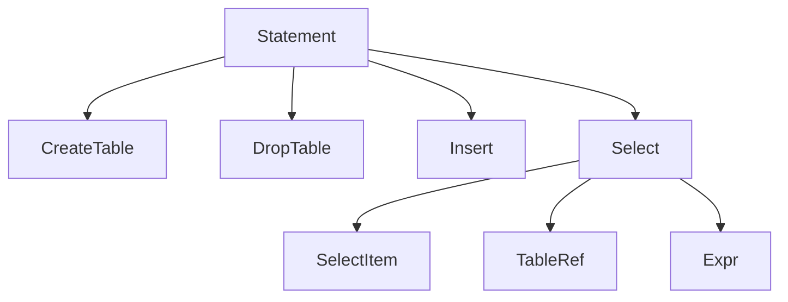

# SQL Parser & AST (Milestone 8)

Status: In Progress — scaffolding complete (module, packages, stubs, tests disabled). Parser/AST implementation TBD.

## Overview
- Goal: Parse a subset of SQL into a typed AST; provide a validator for basic rules.
- Scope: CREATE TABLE, DROP TABLE, INSERT (VALUES), SELECT (projection, single FROM, WHERE with simple expressions).

## Grammar Subset (to be finalized)
- CREATE TABLE tbl (col TYPE[, col TYPE]...)
- DROP TABLE tbl
- INSERT INTO tbl [(col,...)] VALUES (expr,...)[,(expr,...)]
- SELECT item[, item...] FROM tbl [WHERE expr]

## AST Shapes (placeholder)

## Validator Rules (initial)
- Basic identifier validation (non-empty, charset rules TBD).
- Expression arity and operator placement.
- Defer catalog-aware checks to binder in planner milestone.

## TODO
- Implement AST classes in `evolvdb-sql/src/main/java/io/github/anupam/evolvdb/sql/ast/`
- Implement `SqlParser` in `.../sql/parser/`
- Implement `AstValidator` in `.../sql/validate/`
- Add unit tests under `evolvdb-sql/src/test/java/`
- Wire README to point here and move M8 to Completed once done.
