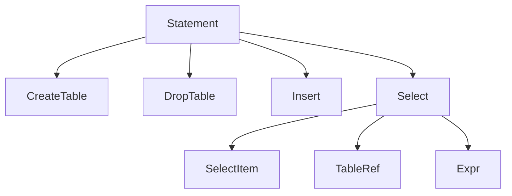

# SQL Parser & AST (Milestone 8)

Status: Completed — parser, AST, validator implemented with tests and docs.

## Overview
- Goal: Parse a subset of SQL into a typed AST; provide a validator for basic rules.
- Scope: CREATE TABLE, DROP TABLE, INSERT (VALUES), SELECT (projection, single FROM, WHERE with simple expressions).

## Grammar Subset (EBNF)

```
statement    := createTable | dropTable | insert | selectStmt ;

createTable  := 'CREATE' 'TABLE' ident '(' columnDef (',' columnDef)* ')' ;
columnDef    := ident typeSpec ;
typeSpec     := 'INT' | 'BIGINT' | 'BOOLEAN' | 'FLOAT' | 'STRING' | 'VARCHAR' '(' number ')' ;

dropTable    := 'DROP' 'TABLE' ident ;

insert       := 'INSERT' 'INTO' ident ['(' ident (',' ident)* ')']
                'VALUES' '(' expr (',' expr)* ')' (',' '(' expr (',' expr)* ')')* ;

selectStmt   := 'SELECT' ('*' | selectItem (',' selectItem)*)
                'FROM' tableRef ['WHERE' expr] ;
selectItem   := expr ['AS' ident | ident] ;
tableRef     := ident ['AS' ident | ident] ;

expr         := orExpr ;
orExpr       := andExpr ('OR' andExpr)* ;
andExpr      := notExpr ('AND' notExpr)* ;
notExpr      := ['NOT'] compExpr ;
compExpr     := addExpr (('='|'!='|'<>|'<'|'<='|'>'|'>=') addExpr)? ;
addExpr      := mulExpr (('+'|'-') mulExpr)* ;
mulExpr      := primary (('*'|'/') primary)* ;
primary      := number | string | 'TRUE' | 'FALSE' | ident ['.' ident] | '(' expr ')' ;

ident        := [A-Za-z_][A-Za-z0-9_]* ;
number       := [0-9]+ ;
string       := '\'' ("''" | ~['\n])* '\'' ;
```

## AST Shapes (placeholder)


## Validator Rules (initial)
- Basic identifier validation (non-empty, charset rules TBD).
- Expression arity and operator placement.
- Defer catalog-aware checks to binder in planner milestone.
  - For M8, we perform limited catalog-aware checks:
    - CREATE TABLE: no duplicate columns; VARCHAR must have positive length; other types must not specify length.
    - INSERT: table exists; provided columns (if any) exist; VALUES arity matches target column count; literal type compatibility checks.
    - SELECT: FROM table exists; column refs exist; qualified refs must match table or alias.
    - DROP TABLE: table exists.

## Examples

Query → AST (simplified):

```sql
SELECT name FROM users WHERE id >= 10 AND active = TRUE;
```

```mermaid
flowchart LR
  Select --> Items[SelectItem(name)]
  Select --> From[TableRef(users)]
  Select --> Where[AND]
  Where --> GE[>=]
  GE --> ColId[ColumnRef(id)]
  GE --> Num10[Literal(10)]
  Where --> Eq[=]
  Eq --> ColActive[ColumnRef(active)]
  Eq --> LitTrue[Literal(TRUE)]
```

```sql
CREATE TABLE users (id INT, name VARCHAR(10), active BOOLEAN)
```

```mermaid
flowchart LR
  CreateTable --> T[users]
  CreateTable --> C1[ColumnDef id INT]
  CreateTable --> C2[ColumnDef name VARCHAR(10)]
  CreateTable --> C3[ColumnDef active BOOLEAN]
```

## TODO
- Extend grammar: JOINs, ORDER BY, GROUP BY, LIMIT
- Add float/decimal literals, NULLs and COALESCE, function calls
- Improve error recovery and suggestions
