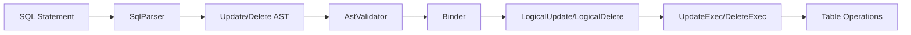
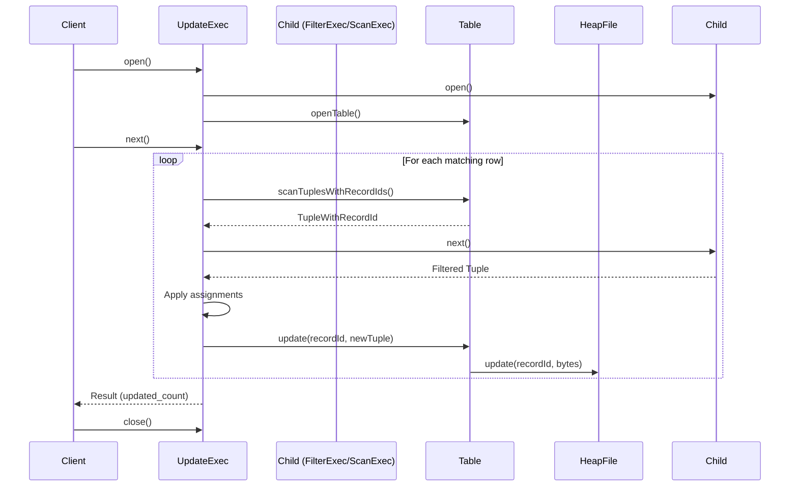
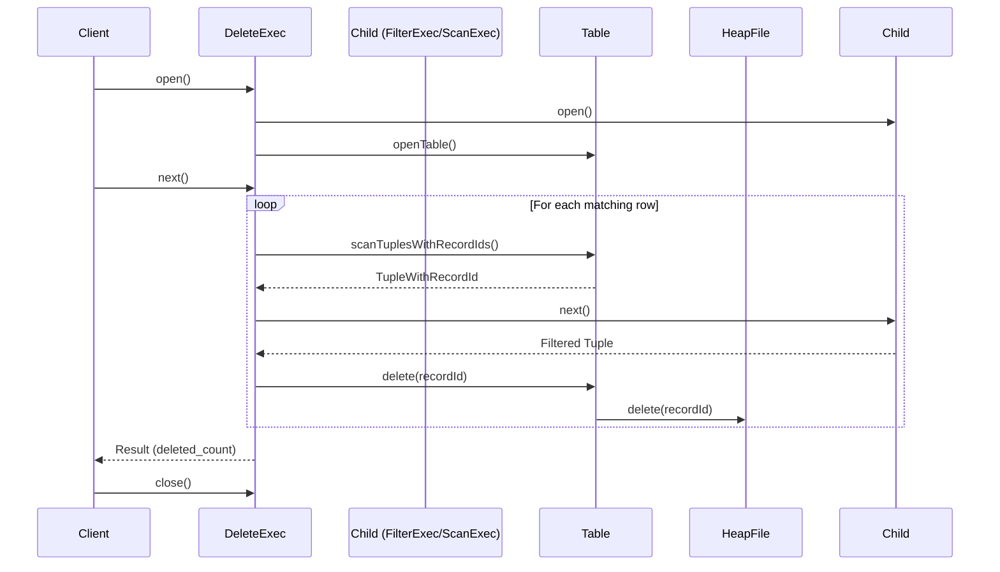

# UPDATE & DELETE Statements (M12)

## Overview

This document describes the implementation of UPDATE and DELETE SQL statements in EvolvDB, completing the basic CRUD (Create, Read, Update, Delete) operations.

## SQL Syntax

### UPDATE Statement
```sql
UPDATE table_name
SET column1 = expr1, column2 = expr2, ...
[WHERE condition];
```

**Examples:**
```sql
-- Update a single column
UPDATE users SET age = 30 WHERE id = 1;

-- Update multiple columns
UPDATE users SET age = 31, name = 'Alice' WHERE id = 1;

-- Update all rows (no WHERE clause)
UPDATE users SET status = 'active';

-- Update with expression
UPDATE products SET price = price * 1.1 WHERE category = 'electronics';
```

### DELETE Statement
```sql
DELETE FROM table_name
[WHERE condition];
```

**Examples:**
```sql
-- Delete specific rows
DELETE FROM users WHERE age < 18;

-- Delete single row
DELETE FROM users WHERE id = 1;

-- Delete all rows (no WHERE clause)
DELETE FROM users;
```

## Architecture

### High-Level Design



### Component Stack

**Layer 1: SQL Parsing**
- `TokenType`: Added UPDATE, DELETE, SET keywords
- `Tokenizer`: Recognizes new keywords
- `SqlParser`: 
  - `parseUpdate()`: Parses UPDATE grammar
  - `parseDelete()`: Parses DELETE grammar

**Layer 2: AST Nodes**
- `Update`: Stores table name, assignments (Map<String, Expr>), WHERE clause
- `Delete`: Stores table name, WHERE clause
- `AstVisitor`: Added `visitUpdate()` and `visitDelete()` methods

**Layer 3: Validation**
- `AstValidator`:
  - `validateUpdate()`: Validates table exists, columns exist in assignments
  - `validateDelete()`: Validates table exists, WHERE references valid columns

**Layer 4: Logical Planning**
- `LogicalUpdate`: Wraps filtered scan with assignments
- `LogicalDelete`: Wraps filtered scan for deletion
- `Binder`:
  - `bindUpdate()`: Creates LogicalScan → LogicalFilter → LogicalUpdate
  - `bindDelete()`: Creates LogicalScan → LogicalFilter → LogicalDelete

**Layer 5: Physical Execution**
- `UpdateExec`: Scans matching rows, applies assignments, updates in HeapFile
- `DeleteExec`: Scans matching rows, deletes from HeapFile
- `PhysicalPlanner`: Maps logical plans to physical operators

**Layer 6: Optimizer Integration**
- `UpdatePlan`/`DeletePlan`: Physical plan wrappers
- `Rules.UpdateRule`/`Rules.DeleteRule`: Optimizer rules
- `CostModel`: Added `costUpdate()` and `costDelete()` methods

### Data Flow

**UPDATE Execution Flow:**


**DELETE Execution Flow:**


## Implementation Details

### Parser Grammar

**UPDATE:**
```
UPDATE <identifier>
SET <identifier> = <expression> [, <identifier> = <expression>]*
[WHERE <expression>]
```

**DELETE:**
```
DELETE FROM <identifier>
[WHERE <expression>]
```

### AST Structure

**Update Node:**
```java
public final class Update extends Statement {
    private final String tableName;
    private final Map<String, Expr> assignments;  // column -> expression
    private final Expr where;  // may be null
}
```

**Delete Node:**
```java
public final class Delete extends Statement {
    private final String tableName;
    private final Expr where;  // may be null
}
```

### Logical Plan Structure

**LogicalUpdate:**
```java
public final class LogicalUpdate implements LogicalPlan {
    private final LogicalPlan child;  // Scan + Filter
    private final String tableName;
    private final Map<String, Expr> assignments;
    private final Schema tableSchema;
}
```

**LogicalDelete:**
```java
public final class LogicalDelete implements LogicalPlan {
    private final LogicalPlan child;  // Scan + Filter
    private final String tableName;
    private final Schema tableSchema;
}
```

### Physical Execution

**UpdateExec:**
- Opens child operator (typically FilterExec → SeqScanExec)
- Scans table with RecordIds using `Table.scanTuplesWithRecordIds()`
- For each matching tuple:
  - Applies assignment expressions to compute new values
  - Calls `Table.update(recordId, newTuple)`
- Returns result tuple with `updated_count`

**DeleteExec:**
- Opens child operator (typically FilterExec → SeqScanExec)
- Scans table with RecordIds using `Table.scanTuplesWithRecordIds()`
- For each matching tuple:
  - Calls `Table.delete(recordId)`
- Returns result tuple with `deleted_count`

### Key Design Decisions

**1. Tuple + RecordId Pairing**

Since tuples don't carry RecordIds through the pipeline (by design for immutability), we added:
```java
public static final class TupleWithRecordId {
    public final Tuple tuple;
    public final RecordId recordId;
}
```

This allows UPDATE/DELETE operators to:
- Scan the table with RecordIds
- Apply WHERE filters via child operators
- Perform actual updates/deletes using RecordIds

**2. WHERE Clause Handling**

The WHERE clause is handled by the child operator chain:
```
UpdateExec
  └── FilterExec (WHERE condition)
        └── SeqScanExec (table scan)
```

This reuses existing filter logic and keeps UPDATE/DELETE operators simple.

**3. Assignment Expression Evaluation**

UPDATE expressions are evaluated using `ExprEvaluator`:
```java
Object value = evaluator.eval(assignments.get(col.name()), oldTuple, schema);
```

This supports:
- Literals: `SET age = 30`
- Column references: `SET new_price = old_price * 1.1`
- Arithmetic: `SET count = count + 1`
- Comparisons and functions

**4. Result Schema**

Both UPDATE and DELETE return a single-column result:
```java
Schema resultSchema = new Schema(List.of(
    new ColumnMeta("updated_count" | "deleted_count", Type.INT, null)
));
```

This follows SQL standard behavior where modification statements return row counts.

## Testing Strategy

**Parser Tests:**
- `givenUpdateStmt_whenParse_thenAstMatches()`
- `givenDeleteStmt_whenParse_thenAstMatches()`
- `givenUpdateWithoutWhere_whenParse_thenNoWhereClause()`

**Validator Tests:**
- `givenUpdateUnknownTable_whenValidate_thenError()`
- `givenUpdateUnknownColumn_whenValidate_thenError()`
- `givenDeleteUnknownTable_whenValidate_thenError()`

**Execution Tests (E2E):**
- `givenTable_whenUpdateWithWhere_thenRowsModified()`
- `givenTable_whenUpdateAllRows_thenAllModified()`
- `givenTable_whenDeleteWithWhere_thenRowsRemoved()`
- `givenTable_whenDeleteAllRows_thenTableEmpty()`

## Limitations & Future Work

**Current Limitations:**
1. No support for UPDATE with JOINs (e.g., `UPDATE t1 SET col = t2.val FROM t2 WHERE ...`)
2. No support for DELETE with JOINs
3. No support for RETURNING clause
4. No transaction support yet (M17) - updates/deletes are not atomic
5. No optimizations for bulk updates/deletes

**Future Enhancements (Post-M12):**
- M13: NULL support in assignments
- M14: Constraint validation on UPDATE
- M16: Index updates on UPDATE/DELETE
- M17: Transactional UPDATE/DELETE with rollback support
- M18: WAL logging for UPDATE/DELETE operations

## Performance Characteristics

**UPDATE:**
- Time: O(n) where n = rows matching WHERE clause
- Space: O(1) per row (in-place update or relocate)
- I/O: 1 read + 1 write per updated row

**DELETE:**
- Time: O(n) where n = rows matching WHERE clause
- Space: O(1) per row (tombstone marking)
- I/O: 1 read + 1 write per deleted row

**Optimization Opportunities:**
- Batch updates/deletes to reduce I/O
- Index-aware deletes (when M16 is implemented)
- Predicate pushdown to reduce scan cost

## Examples

### Complete Example: User Management

```sql
-- Create table
CREATE TABLE users (
    id INT,
    name VARCHAR(50),
    age INT,
    status VARCHAR(20)
);

-- Insert data
INSERT INTO users VALUES (1, 'Alice', 25, 'active');
INSERT INTO users VALUES (2, 'Bob', 17, 'active');
INSERT INTO users VALUES (3, 'Charlie', 30, 'inactive');

-- Update single user
UPDATE users SET status = 'premium' WHERE id = 1;
-- Result: 1 row updated

-- Update based on condition
UPDATE users SET status = 'inactive' WHERE age < 18;
-- Result: 1 row updated (Bob)

-- Delete inactive users
DELETE FROM users WHERE status = 'inactive';
-- Result: 2 rows deleted (Bob and Charlie)

-- Verify remaining data
SELECT * FROM users;
-- Result: Only Alice remains
```

## References

- SQL Parser: `evolvdb-sql/src/main/java/io/github/anupam/evolvdb/sql/parser/SqlParser.java`
- AST Nodes: `evolvdb-sql/src/main/java/io/github/anupam/evolvdb/sql/ast/{Update,Delete}.java`
- Logical Plans: `evolvdb-planner/src/main/java/io/github/anupam/evolvdb/planner/logical/{LogicalUpdate,LogicalDelete}.java`
- Physical Operators: `evolvdb-exec/src/main/java/io/github/anupam/evolvdb/exec/op/{UpdateExec,DeleteExec}.java`
- Optimizer Rules: `evolvdb-exec/src/main/java/io/github/anupam/evolvdb/optimizer/Rules.java`
