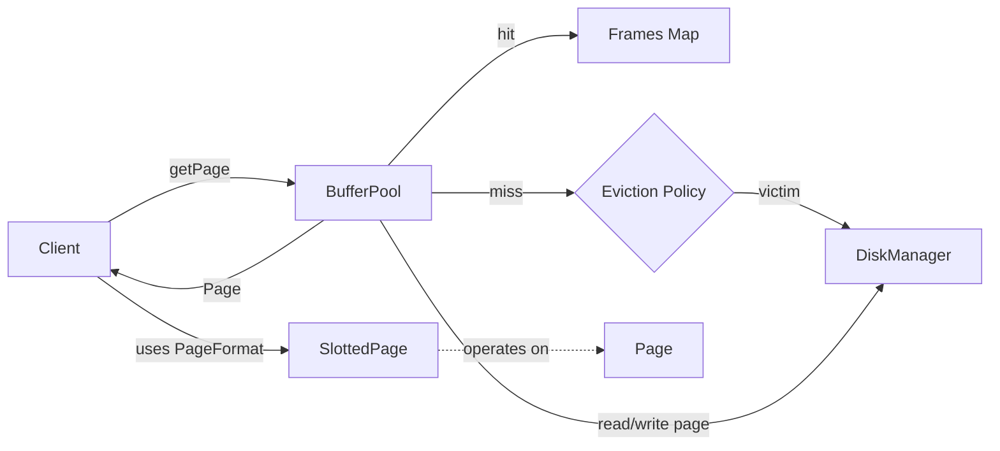
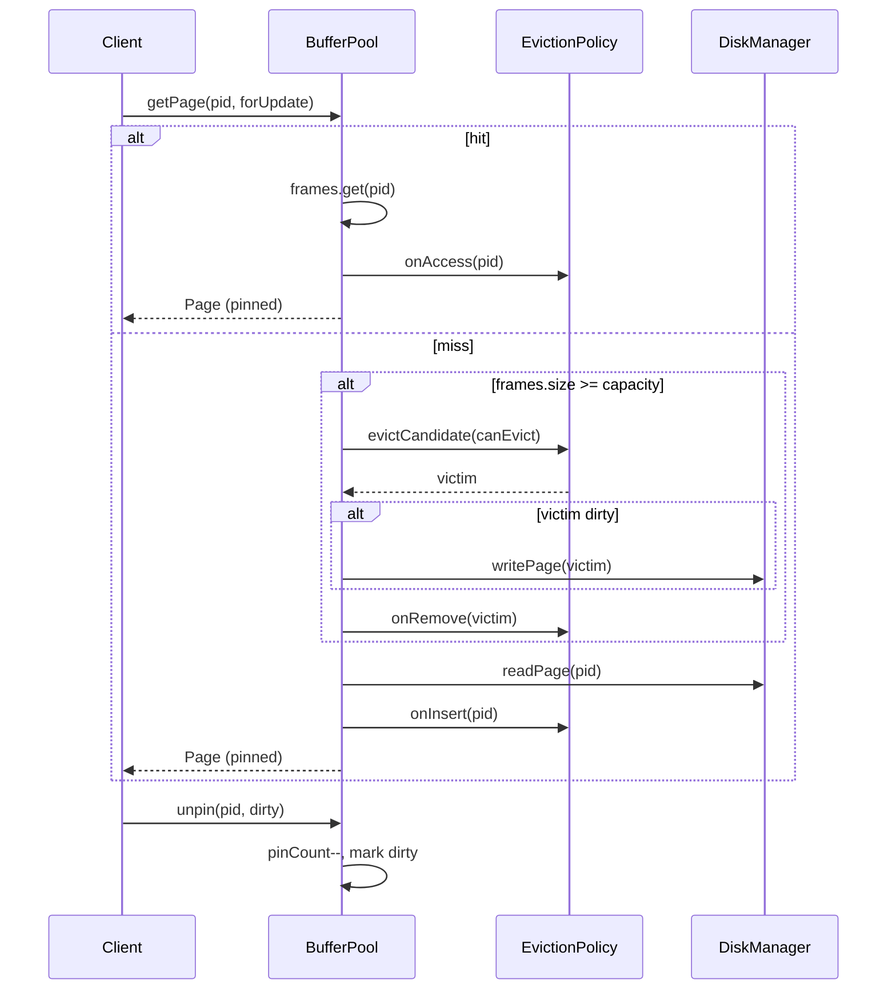

# BufferPool

Status: M2 implemented (DefaultBufferPool with LRU eviction).

See also: [Slotted Page Format](./slotted-page.md) for the in-page record layout that BufferPool pages will contain.

## High-Level Design (HLD)

- Responsibilities:
  - Cache fixed-size pages in memory.
  - Provide pin/unpin semantics to protect in-use pages from eviction.
  - Track dirty pages and flush on eviction or explicit flush.
  - Evict pages using a pluggable policy (Strategy), default LRU.
- Boundaries:
  - Uses `DiskManager` for I/O.
  - Exposes `Page` abstraction from `storage-page`.
  - Does not understand record layout (page format), only raw pages.

## Low-Level Design (LLD)

- Data structures:
  - `Map<PageId, Frame>` frames
  - `EvictionPolicy` (Strategy) with default `LruEvictionPolicy`
  - `Frame`: `PageId id`, `ByteBuffer buffer`, `int pinCount`, `boolean dirty`
- Concurrency:
  - Synchronized methods for v0 (coarse-grained). Per-page locks later.
- Lifecycle:
  - `getPage` increments pinCount; `unpin` decrements and sets dirty.
  - On miss when full: ask policy for a victim satisfying `pinCount == 0`.
  - If victim is dirty: flush before removal.

## Interfaces and Contracts

- `BufferPool` API: see `evolvdb-storage-buffer` module.
- `EvictionPolicy` API:
  - `onInsert`, `onAccess`, `onRemove`
  - `evictCandidate(Predicate<PageId> canEvict)` must return first eligible victim or null.

## Design Patterns

- Strategy: `EvictionPolicy`, `LruEvictionPolicy`.
- Facade-like: `BufferPool` hides I/O and caching details from clients.

## SOLID

- SRP: BufferPool caches and mediates I/O; page layout is separate.
- OCP: New eviction policies can be added without changing BufferPool.
- LSP: Any `EvictionPolicy` can substitute `LruEvictionPolicy`.
- ISP: BufferPool exposes minimal methods needed by clients.
- DIP: BufferPool depends on abstractions (`DiskManager`, `EvictionPolicy`).

## Trade-offs & Alternatives

- Coarse-grained synchronization is simple but limits concurrency; future: per-frame locks.
- LRU is easy but can be suboptimal (scan-resistant); future: CLOCK/2Q.
- Dirty tracking at frame level; future: write-back policies, checkpoints.

## Tests (BDD)

- givenSmallPool_whenThirdPageLoaded_thenEvictsLruAndFlushesDirty
- givenAllPinned_whenLoadNewPage_thenThrowsNoEvictable
