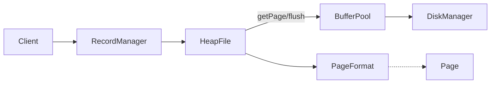

# HeapFile and RecordManager

Status: M4 implemented (HeapFile + RecordManager) with tests and CLI demo.

See also:
- [BufferPool](./buffer-pool.md)
- [Slotted Page Format](./slotted-page.md)
- [Scan and Update](./scan-and-update.md)
- [Catalog](../catalog/catalog.md)

## High-Level Design (HLD)

- HeapFile stores variable-length records across pages using a `PageFormat` (Strategy).
- RecordManager is a small facade that opens/creates one `HeapFile` per logical file (`FileId`).
- Interactions:



## Low-Level Design (LLD)

### Data Structures

- `HeapFile`
  - Fields: `FileId fileId`, `DiskManager disk`, `BufferPool buffer`, `PageFormat format`
  - Methods:
    - `insert(byte[]): RecordId`
    - `read(RecordId): byte[]`
    - `delete(RecordId)`
- `RecordManager`
  - Fields: `DiskManager disk`, `BufferPool buffer`, `Map<String, HeapFile> open`
  - Methods:
    - `openHeapFile(String, PageFormat): HeapFile`

### Insert Algorithm

```mermaid
sequenceDiagram
  participant C as Client
  participant HF as HeapFile
  participant BP as BufferPool
  participant DM as DiskManager
  participant PF as PageFormat

  C->>HF: insert(record)
  HF->>DM: pageCount(file)
  loop pages
    HF->>BP: getPage(pid, forUpdate=true)
    HF->>PF: freeSpace(page)
    alt enough space
      HF->>PF: insert(page, record)
      HF->>BP: unpin(pid, dirty=true)
      HF-->>C: RecordId
      break
    else not enough
      HF->>BP: unpin(pid, dirty=false)
    end
  end
  alt none found
    HF->>DM: allocatePage(file)
    HF->>BP: getPage(newPid, forUpdate=true)
    HF->>PF: init(page)
    HF->>PF: insert(page, record)
    HF->>BP: unpin(newPid, dirty=true)
    HF-->>C: RecordId
  end
```

### Read/Delete

- `read(rid)` pins page read-only, delegates to `PageFormat.read`, unpins.
- `delete(rid)` pins page for update, calls `PageFormat.delete`, marks dirty, unpins.

### Extensibility & SOLID

- Strategy: `PageFormat` lets us swap in other formats (fixed-length/hybrid) later.
- SRP: HeapFile manages page selection/allocation, not in-page layout.
- OCP/DIP: Works with any `PageFormat` and `EvictionPolicy` via BufferPool.

## Edge Cases

- Page full: allocate new page.
- Fragmentation: `SlottedPageFormat.insert` compacts as needed.
- Multi-page files: `pageCount` guides search across existing pages.

## Tests

- givenEmptyFile_whenInsert_thenRecordReadable
- givenPageFull_whenInsert_thenAllocatesNewPage
- givenDeletions_whenInsertLarge_thenCompactionAllowsInsert

## CLI Demo

The CLI uses `Database` + `RecordManager` + `SlottedPageFormat` to:
- Create/open a heap file
- Insert two records
- Read them back

Run:

```bash
./gradlew :evolvdb-cli:run -Devolvdb.dataDir=./data
```
