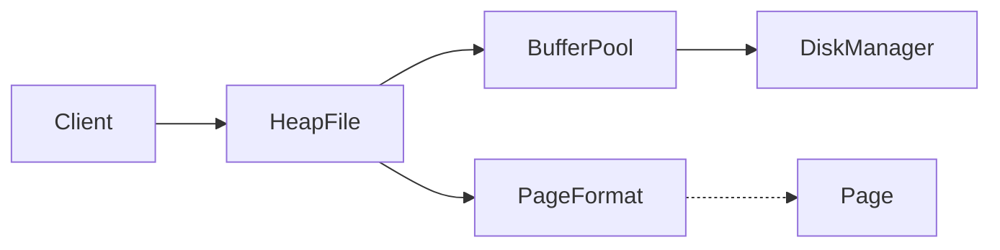
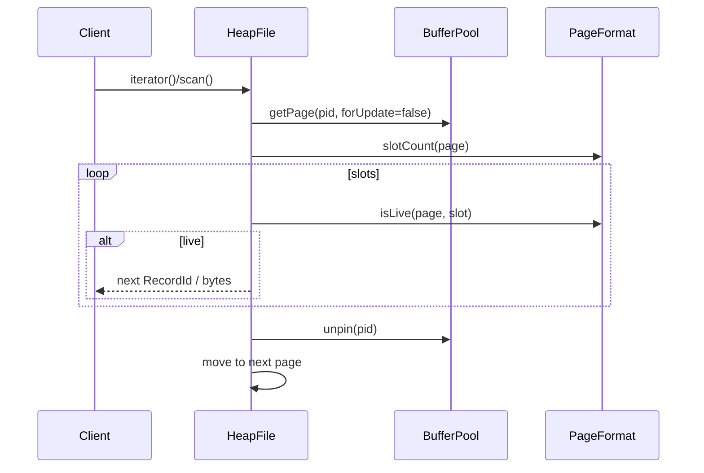

# Scan and Update (M5)

Status: Implemented (HeapFile iterator/scan, update with in-place or relocate) with tests and CLI demo.

See also:
- [HeapFile](./heap-file.md)
- [Slotted Page Format](./slotted-page.md)
- [BufferPool](./buffer-pool.md)

## High-Level Design (HLD)

- HeapFile.scan walks pages in order, visiting slots in order, skipping tombstones.
- Update attempts in-place write when possible; otherwise deletes and reinserts, potentially changing RecordId.



## Low-Level Design (LLD)

### Scan



Notes:
- Iterator yields `RecordId`s; `scan()` wraps iterator and returns bytes via `read(rid)`.
- Pages are pinned while iterating their slots and unpinned before advancing to the next page.

### Update

```mermaid
flowchart TB
  A[update(rid, newBytes)] --> B{PageFormat.update\ncan do in-place?}
  B -- yes --> C[Overwrite in place\nupdate slot len\nmark page dirty]
  B -- no --> D[delete(rid)] --> E[insert(newBytes)]
  E --> F[return newRid]
  C --> G[return original rid]
```

In-place update rules for SlottedPageFormat:
- If new length <= current length: overwrite and shrink length.
- Else if record is at end of payload and contiguous free space is available: grow in place and advance freeStart.
- Otherwise: not possible in place -> relocate (delete + insert).

RecordId semantics:
- Stable on in-place updates.
- May change on relocation; callers must handle a new RecordId.

## Tests (BDD)

- givenMultiplePages_whenScan_thenAllLiveRecordsVisitedInOrder
- givenUpdateLarger_whenNotAtEnd_thenRelocateAndRecordIdChanges
- givenUpdateSmaller_whenShrink_thenInPlaceAndIdStable

## Future Work

- Scan with filtering and projection operators.
- Range scans with indexes.
- Update policies with logging and recovery (txn/recovery milestones).
