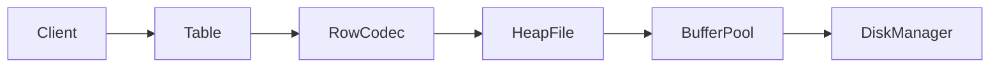
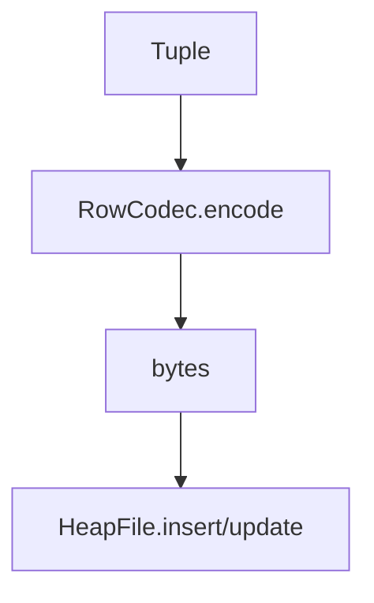

# Tuple & RowCodec (M7)

Status: In Progress — Tuple abstraction and RowCodec implemented; integrated with Catalog Table for tuple storage over HeapFile; tests pending finalization.

See also:
- [Catalog & Schema](../catalog/catalog.md)
- [HeapFile](../storage/heap-file.md)
- [Scan & Update](../storage/scan-and-update.md)

## High-Level Design (HLD)

- Tuple is an immutable row instance bound to a `Schema`.
- RowCodec encodes/decodes a Tuple to/from binary for storage in HeapFile.
- Table wraps a HeapFile to offer tuple-oriented APIs: insert/read/update/scan.

## Low-Level Design (LLD)

### Types supported
- Fixed-width: INT(4), BIGINT(8), BOOLEAN(1), FLOAT(4)
- Var-width: STRING, VARCHAR(N)

### Encoding format (little-endian)
- INT: 4 bytes
- BIGINT: 8 bytes
- BOOLEAN: 1 byte (0/1)
- FLOAT: 4 bytes IEEE-754
- STRING/VARCHAR: [u16 byteLen][UTF-8 bytes]

Constraints:
- VARCHAR length enforced by Tuple against declared max (characters).
- Byte length limit for string fields is 65535 due to u16 length prefix.

### Update semantics
- Table.update uses HeapFile.update with RowCodec re-encoding.
- In-place update if new payload fits current slot (per SlottedPage rules), else relocate.

## APIs
- `Tuple(Schema, List<Object>)` — validates types against schema.
- `RowCodec.encode(schema, tuple) -> byte[]` (requires identical schema instance)
- `RowCodec.decode(schema, bytes) -> Tuple`
- `Table.insert(Tuple) -> RecordId`
- `Table.read(RecordId) -> Tuple`
- `Table.update(RecordId, Tuple) -> RecordId`
- `Table.scanTuples() -> Iterable<Tuple>`

## Tests
- RowCodec round-trip encode/decode.
- Tuple schema mismatch error on encode.
- VARCHAR length enforcement.
- Table integration: insert/scan, read back tuples.

## Future work
- Nullability and default values.
- Columnar encoding and compression options.
- Vectorized scans and predicate pushdown.
